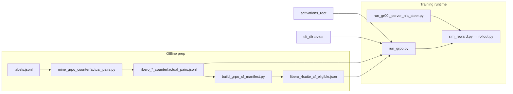

# GRPO agent reference (nla-groot)

Onboarding doc for agents working on **GRPO** (Group Relative Policy Optimization) in this repo. For general NLA concepts (α, SFT, labeling), start with [`docs/NLA_AGENT_KNOWLEDGE.md`](NLA_AGENT_KNOWLEDGE.md). For sim steer infrastructure, see [`docs/evals/sim_steer_rollout.md`](evals/sim_steer_rollout.md).

---

## Mental model

GRPO trains the **policy AV** on unlabeled activations:

1. Sample `B` activation vectors `h` (no captions).
2. Roll out `K` text samples per `h` from the policy AV.
3. Score each rollout with one or more reward terms.
4. Mean-center rewards **within each group of K** → advantages.
5. Policy-gradient update on AV log-probs + optional KL to frozen reference AV.

**Default reward:** reconstruction — `reward ∝ -|| AR(y) - h/α ||²` using the **frozen** AR from SFT.

**Sim-GRPO (Framing B):** adds a second reward term: short LIBERO rollouts steered by `AR(y)`, scored with geometric predicates. Requires mined **counterfactual pairs** linking each activation id to a `(target_intent, target_task, target_env_name)`.

---

## End-to-end sim-GRPO pipeline



### Typical commands (LIBERO 4-suite)

```bash
# 0. Steer server (separate shell, must stay up during sim steps)
PYTHONPATH=src .venv/bin/python scripts/eval/run_gr00t_server_nla_steer.py \
  --ar-dir data/sft/libero_4suite_v4_consistency_overnight/ar \
  --host localhost --port 5556 \
  --model-path checkpoints/GR00T-N1.7-LIBERO/libero_goal \
  --embodiment-tag LIBERO_PANDA \
  --steer-text-file scripts/eval/default_steer_boot.txt

# 1. Mine CF pairs (repeat per suite or use --suite all)
PYTHONPATH=src .venv/bin/python scripts/training/mine_grpo_counterfactual_pairs.py \
  --labels data/labels/libero_4suite_combined/labels.jsonl \
  --suite spatial \
  --out data/grpo/libero_spatial_counterfactual_pairs.jsonl

# 2. Build GRPO-eligible id manifest (recommended — avoids wasted steps)
PYTHONPATH=src .venv/bin/python scripts/training/build_grpo_cf_manifest.py \
  --pairs data/grpo/libero_goal_counterfactual_pairs.jsonl \
  --pairs-extra data/grpo/libero_spatial_counterfactual_pairs.jsonl \
  --pairs-extra data/grpo/libero_object_counterfactual_pairs.jsonl \
  --pairs-extra data/grpo/libero_10_counterfactual_pairs.jsonl \
  --out data/grpo/libero_4suite_cf_eligible.json

# 3. Train
PYTHONPATH=src .venv/bin/python scripts/training/run_grpo.py \
  --sft-dir data/sft/libero_4suite_v4_consistency_overnight \
  --activations-root data/activations/libero_4suite_v4_combined \
  --output-dir data/grpo/my_run \
  --sim-reward-weight 0.5 \
  --sim-counterfactual-pairs-path data/grpo/libero_goal_counterfactual_pairs.jsonl \
  --sim-counterfactual-pairs-path-extra data/grpo/libero_spatial_counterfactual_pairs.jsonl \
  --sim-counterfactual-pairs-path-extra data/grpo/libero_object_counterfactual_pairs.jsonl \
  --sim-counterfactual-pairs-path-extra data/grpo/libero_10_counterfactual_pairs.jsonl \
  --cf-eligible-ids-path data/grpo/libero_4suite_cf_eligible.json \
  --sim-policy-host localhost --sim-policy-port 5556 \
  --sim-rollout-python third_party/Isaac-GR00T/gr00t/eval/sim/LIBERO/libero_uv/.venv/bin/python \
  --disable-kl-anchor --dynamic-sampling --use-ppo-clip \
  --batch-size 2 --rollouts-per-activation 4 --total-steps 200
```

Always set `PYTHONPATH=src` when invoking scripts from the repo root.

---

## Code map (read these first)

| Area | Path | Role |
|------|------|------|
| **CLI entry** | `scripts/training/run_grpo.py` | Argparse → `GRPOConfig` → `run_grpo()` |
| **Trainer core** | `src/nla/training/grpo.py` | `GRPOConfig`, `grpo_step()`, `run_grpo()` main loop |
| **Activation data** | `src/nla/training/dataset.py` | `SampledPositionDataset` — one random position per activation shard |
| **CF lookup** | `src/nla/training/counterfactual_data.py` | `CounterfactualPairSampler`, manifest helpers |
| **Sim worker** | `src/nla/training/sim_reward.py` | AR encode → subprocess rollouts → `r_sim` tensor |
| **CF mining** | `scripts/training/mine_grpo_counterfactual_pairs.py` | Labels → CF JSONL (multi-suite: goal/spatial/object/10) |
| **CF mining (alt)** | `scripts/training/mine_grpo_counterfactual_pairs_methodical.py` | Site/object swap targets instead of uniform random |
| **GRPO pool filter** | `scripts/training/build_grpo_cf_manifest.py` | CF JSONLs → eligible `example_ids` manifest |
| **CF audits** | `scripts/training/audit_cf_pairs.py` | Content/ balance gate (goal-oriented) |
| **Sim audit** | `scripts/training/audit_cf_pairs_sim_feasibility.py` | BDDL body validation + optional env probe |
| **Orchestrator** | `scripts/training/orchestrate_v4_to_grpo.sh` | SFT → eval → steer server → GRPO pilot |
| **Steer server** | `scripts/eval/run_gr00t_server_nla_steer.py` | Long-running ZMQ policy + backbone steer hook |
| **Rollout subprocess** | `src/nla/eval/steerability/rollout.py` | LIBERO env loop, obs packing for bare `Gr00tPolicy` |
| **Success rules** | `src/nla/eval/steerability/predicates.py` | Goal-task geometric predicates (10 tasks) |
| **BDDL validation** | `src/nla/eval/steerability/bddl_bodies.py` | Ensure CF target bodies exist in scene BDDL |
| **Suite task names** | `src/nla/eval/steerability/libero_suites.py` | Map label suite → LIBERO benchmark language / BDDL dir |
| **Body / object logging** | `src/nla/eval/steerability/object_logger.py` | MuJoCo body lookup (`name` / `name_main` fallback) |

### Tests (run before/after GRPO changes)

| Test file | Covers |
|-----------|--------|
| `tests/test_grpo_smoke.py` | Tiny end-to-end trainer smoke |
| `tests/test_grpo_sim_reward.py` | Sim reward wiring, partial batch CF, extra paths |
| `tests/test_grpo_simplevla.py` | Dynamic sampling, PPO clip, disable-KL flags |
| `tests/test_grpo_judge_reward.py` | Optional multimodal judge blend |
| `tests/test_counterfactual_data.py` | CF sampler dual-key index, merge, manifest helpers |
| `tests/test_bddl_bodies.py` | BDDL body parsing / validation |
| `tests/test_mine_grpo_cf_methodical.py` | Methodical miner |

```bash
PYTHONPATH=src .venv/bin/python -m pytest tests/test_grpo_sim_reward.py tests/test_counterfactual_data.py -q
```

---

## Training loop internals

### Data: `SampledPositionDataset`

- Reads `activations_root/index.jsonl` + shards via `ActivationShardReader`.
- **Does not read `labels.jsonl`** for training rows.
- Each `__getitem__` returns one `(activation, position_type, position_index, example_id)`.
- `example_id` == activation shard id, e.g. `spatial__traj000355_step000026`.
- Episode-stratified train/val split by default (`--split-by episode`).

**CF-eligible filter** (`--cf-eligible-ids-path`): restricts the pool to ids present in the manifest so every sampled row has a mined CF pair. Without this, ~65% of random rows miss CF lookup (when only 5k pairs / suite are mined).

### Counterfactual lookup

`CounterfactualPairSampler` indexes each JSONL row under:

- `source_example_id` (activation id — what GRPO passes in `batch["example_id"]`)
- `example_id` (label-row id, often `source@pNNN_position_type`)

Multiple CF files merge with dedup on `(source_example_id, target_intent, target_task, target_env_name)`.

In `run_grpo()` (see `grpo.py` ~1540):

```python
pairs = cf_sampler.sample_for(source_ids)
sim_cf_ok = [bool(p.target_task and p.target_env_name) for p in pairs]
```

- **`sim_cf_ok`**: per-row mask; ineligible rows skip sim jobs but still get recon reward.
- **`sim_require_full_batch_cf`**: legacy all-or-nothing gate (skip entire sim term if any row misses).

### One step: `grpo_step()`

Located in `src/nla/training/grpo.py` (~741+).

1. **Rollout** policy AV → `K` texts per activation.
2. **Recon reward** — frozen AR scores each text vs `h/α`.
3. **Optional judge reward** — multimodal API vs cached frames (`judge_reward_weight`).
4. **Optional sim reward** — encode texts with AR → steer vectors → `SimRewardWorker` subprocess pool.
5. **Blend** recon + judge + sim (weights from config); z-score within each group of K.
6. **Loss** — PG on AV + optional KL to ref AV + optional AR co-train MSE.

Key sim metrics logged to `metrics.jsonl`:

- `sim_active_frac` — fraction of rollouts that ran sim (should be **1.0** with CF manifest filter)
- `sim_reward_mean`, `sim_predicate_pos_frac`, `sim_error_frac`, `sim_elapsed_s_mean`

### Sim subprocess path

Trainer never imports LIBERO. Flow:

1. `sim_reward.encode_texts_with_ar()` — backbone steer vectors from rollout text.
2. `sim_reward.assemble_jobs()` + thread pool.
3. Each job shells out to `src/nla/eval/steerability/rollout.py` using `--sim-rollout-python` (libero_uv venv).
4. Rollout connects to steer server (`--sim-policy-host/port`), sends `steer_h` each step.
5. `predicates.py` scores trajectory → `r_sim` printed as JSON stdout.

Rollouts are **CPU-bound** (MuJoCo + OSMesa rendering in subprocesses). Default **`--sim-n-workers 8`** runs up to eight LIBERO subprocesses in parallel; the steer server handles concurrent ZMQ `get_action` calls on GPU.

---

## ID conventions (common confusion)

| Id | Example | Used by |
|----|---------|---------|
| **Activation / source id** | `goal__traj000084_step000032` | `SampledPositionDataset.example_id`, CF `source_example_id`, GRPO batch lookup |
| **Label example id** | `spatial__traj000355_step000026@p095_image_patch` | CF JSONL `example_id`, labeling pipeline |
| **Suite prefix** | `goal__`, `spatial__`, `object__`, `10__` | Parsed from id string; mining filters labels by suite |

GRPO always looks up CF pairs by **activation id** (`batch["example_id"]`), not the `@pNNN_` suffix.

---

## Counterfactual mining design notes

`mine_grpo_counterfactual_pairs.py`:

- **`--suite`**: `goal`, `spatial`, `object`, `10`, or `all`.
- **Sim predicates are Goal-only** today → `target_task` / `target_env_name` always reference a **Goal** benchmark task, even when the source row is spatial/object/10 (cross-suite steering).
- **`--matching-fraction`**: fraction of rows where `target_intent == source_intent` (goal default ~0.5; non-goal suites mined at 100% counterfactual).
- **`--max-total`**: caps rows; 5000/suite ≈ **35%** of unique activation ids. Remove cap for full coverage.
- BDDL body validation runs at mine time and load time (`validate_bodies_in_bddl=True` default).

Audits:

- `audit_cf_pairs.py --gate` — expects goal-style balance; **will FAIL** on 100%-counterfactual spatial/object/10 files (expected).
- `audit_cf_pairs_sim_feasibility.py` — the gate that matters for sim; checks BDDL bodies.

---

## Key CLI flags (`run_grpo.py`)

| Flag | Default | Notes |
|------|---------|-------|
| `--sft-dir` | required | Must contain `av/` and `ar/` |
| `--activations-root` | required | Phase-1 extraction dump |
| `--batch-size` | 4 | Distinct activations per step (`B`) |
| `--rollouts-per-activation` | 8 | Group size (`K`) |
| `--sim-reward-weight` | 0 | >0 enables sim term |
| `--sim-counterfactual-pairs-path` | — | Primary CF JSONL |
| `--sim-counterfactual-pairs-path-extra` | [] | Repeatable; merged into sampler |
| `--cf-eligible-ids-path` | — | Manifest from `build_grpo_cf_manifest.py` |
| `--sim-require-full-batch-cf` | off | All-or-nothing sim gate |
| `--sim-policy-port` | 5555 | Must match running steer server |
| `--sim-n-workers` | **8** | Concurrent LIBERO subprocesses (CPU/OSMesa) |
| `--sim-max-steps` | 100 | Max sim steps per rollout |
| `--sim-rollout-python` | — | **Required** for sim; libero_uv venv python |
| `--disable-kl-anchor` | off | Skip ref AV; saves memory |
| `--dynamic-sampling` | auto on sim | Drop zero-variance groups |
| `--use-ppo-clip` | off | Mostly no-op at 1 step/update |
| `--rollout-temperature-high` | — | Override rollout temperature (e.g. 1.6) |
| `--judge-reward-weight` | 0 | Multimodal judge blend |
| `--frames-cache` | — | Required if judge > 0 |

Full config lands in `<output_dir>/config.json`; step metrics in `metrics.jsonl`; human log in `grpo_run.log`.

---

## Production artifact paths (LIBERO 4-suite v4)

Typical locations under `data/` (gitignored; may live on NFS):

| Artifact | Path |
|----------|------|
| SFT checkpoint | `data/sft/libero_4suite_v4_consistency_overnight/` |
| Activations | `data/activations/libero_4suite_v4_combined/` |
| Labels | `data/labels/libero_4suite_combined/labels.jsonl` |
| CF pairs (goal) | `data/grpo/libero_goal_counterfactual_pairs.jsonl` |
| CF pairs (spatial/object/10) | `data/grpo/libero_{spatial,object,10}_counterfactual_pairs.jsonl` |
| CF-eligible manifest | `data/grpo/libero_4suite_cf_eligible.json` |
| Filtered sim-GRPO run | `data/grpo/libero_4suite_v4_sim_grpo_cffiltered_*` |

---

## Common pitfalls

1. **Missing `PYTHONPATH=src`** → `ModuleNotFoundError: nla`.
2. **Steer server not running** → sim jobs hang or error; check `ss -tlnp | grep 5556`.
3. **CF coverage gap** — 5k mined rows / suite leaves ~65% of activations without pairs; use manifest filter or mine full corpus.
4. **`missing a CF pair` logs** — expected without `--cf-eligible-ids-path`; partial blend still trains on recon for those rows.
5. **Goal-only predicates** — sim scores Goal env geometry even when source activation is from spatial/object/10; cross-suite sim is approximate.
6. **Embodiment mismatch** — GR00T checkpoint must match sim (`LIBERO_PANDA` for LIBERO).
7. **Rollout obs keys** — bare `Gr00tPolicy` needs nested obs; see `_to_server_obs()` in `rollout.py`.
8. **MuJoCo body names** — `_resolve_body_name()` tries `name` and `name_main`; missing bodies skip logging rather than abort.

---

## Related docs

- [`docs/NLA_AGENT_KNOWLEDGE.md`](NLA_AGENT_KNOWLEDGE.md) — α, SFT, labeling, metric interpretation
- [`docs/evals/v2_lessons_learned.md`](evals/v2_lessons_learned.md) — template collapse, why GRPO exists
- [`docs/sft_plan/02_hyperparams.md`](sft_plan/02_hyperparams.md) — V3 GRPO hyperparam defaults
- [`docs/evals/sim_steer_rollout.md`](evals/sim_steer_rollout.md) — steer server setup
- [`docs/evals/libero_goal_pilot_results.md`](evals/libero_goal_pilot_results.md) — closed-loop LIBERO pilot numbers

---

## Where to edit for typical tasks

| Task | Start here |
|------|------------|
| Add a new reward term | `grpo_step()` in `grpo.py`, wire CLI in `run_grpo.py` |
| Change sim scoring | `predicates.py`, then `rollout.py` summary fields |
| Support new LIBERO suite in mining | `libero_suites.py`, `mine_grpo_counterfactual_pairs.py` |
| Fix CF lookup misses | `counterfactual_data.py` indexing; check id key alignment |
| Speed up sim steps | `sim_reward.py` workers/cache; `--sim-n-workers`, `--sim-max-steps` |
| Filter training pool | `SampledPositionDataset.allowed_example_ids`, manifest builder |
| Add GRPO dataset constraint | Extend `SampledPositionDataset` or add pre-filter in `_build_dataloaders` |
