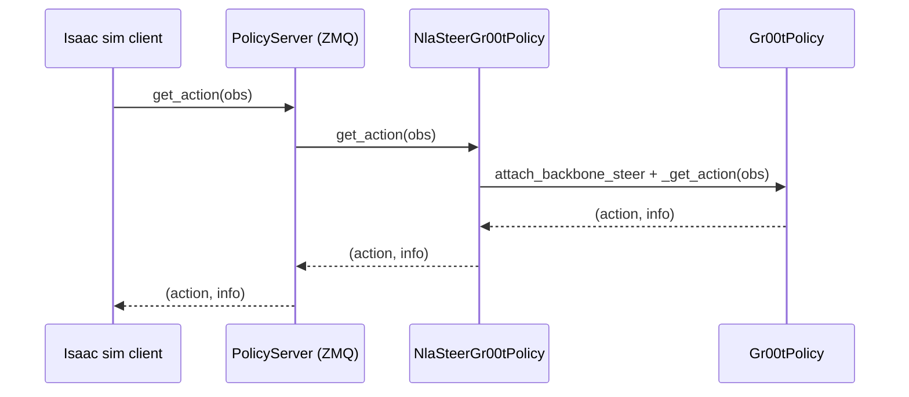

# Sim-backed steerability rollout (server hook)

This runbook walks through driving an Isaac-GR00T sim client (LIBERO or
SimplerEnv) against a GR00T policy server that applies an NLA backbone steer on
every `get_action`. The point is to observe a **behavioral** difference under
intervention — not just `Δaction` on a frozen observation — using the same
infrastructure NVIDIA already ships for closed-loop sim eval.

## Architecture



The wrapper lives in [src/nla/steering/sim_policy_wrapper.py](../../src/nla/steering/sim_policy_wrapper.py)
and is launched by [scripts/eval/run_gr00t_server_nla_steer.py](../../scripts/eval/run_gr00t_server_nla_steer.py),
which mirrors NVIDIA's [run_gr00t_server.py](../../third_party/Isaac-GR00T/gr00t/eval/run_gr00t_server.py)
(same `tyro` `ServerConfig` shape, same `PolicyServer` wiring) and inserts the
wrapper only when `--ar-dir` plus a steer prompt are supplied.

## Prerequisites

1. **GR00T env**: the Isaac-GR00T `.venv` (Python 3.10) with `isaac-gr00t`
   installed exactly as documented in `third_party/Isaac-GR00T/README.md` —
   same env you use for `scripts/extraction/run_extract.py`.
2. **HF access**: `HF_TOKEN` (and `HUGGING_FACE_HUB_TOKEN` for older
   `huggingface_hub`) with access to `nvidia/Cosmos-Reason2-2B`. GR00T pulls
   the Cosmos processor at first load and a 403 here looks like an unrelated
   error.
3. **Sim install**: install **one** of NVIDIA's sim packages — they are not
   bundled with `isaac-gr00t` itself:
   - LIBERO: `bash gr00t/eval/sim/LIBERO/setup_libero.sh` from
     [examples/LIBERO/README.md](../../third_party/Isaac-GR00T/examples/LIBERO/README.md).
   - SimplerEnv: `bash gr00t/eval/sim/SimplerEnv/setup_SimplerEnv.sh` from
     [examples/SimplerEnv/README.md](../../third_party/Isaac-GR00T/examples/SimplerEnv/README.md).
4. **AR checkpoint**: a trained `ar/` directory from `run_sft.py`
   (`data/sft/<run>/ar/`). `load_ar_from_sft` reads the same layout used by
   the rest of the codebase.
5. **Steer prompt file**: a UTF-8 text file with bullet text in the same style
   as `labels.jsonl` (the AR was warm-started on
   `render_ar_prompt(description)` from that corpus).

## Embodiment-match rule

The checkpoint's embodiment **must** match the sim's embodiment, exactly as in
the upstream sim READMEs. Mixing them up silently produces nonsense actions
that look like steering failures but are actually checkpoint/sim mismatches.

| Sim                        | Embodiment tag                          | Compatible checkpoints (examples)             |
|----------------------------|-----------------------------------------|-----------------------------------------------|
| LIBERO suites              | `LIBERO_PANDA`                          | `nvidia/GR00T-N1.7-LIBERO/libero_<suite>`     |
| SimplerEnv (Google robot)  | `SIMPLER_ENV_GOOGLE`                    | `nvidia/GR00T-N1.7-SimplerEnv-Fractal`        |
| SimplerEnv (WidowX bridge) | `SIMPLER_ENV_WIDOWX`                    | `nvidia/GR00T-N1.7-SimplerEnv-Bridge`         |

Pass `--use-sim-policy-wrapper` so observations arrive in the flat
`video.<cam>` / `state.<key>` form the sim clients emit.

## Two-terminal flow

### Terminal A — NLA-steered policy server (GPU)

```bash
cd /home/ubuntu/nla-groot
source third_party/Isaac-GR00T/.venv/bin/activate   # GR00T env
export HF_TOKEN=<your token>
export HUGGING_FACE_HUB_TOKEN=$HF_TOKEN

PYTHONPATH=src python scripts/eval/run_gr00t_server_nla_steer.py \
    --model-path nvidia/GR00T-N1.7-LIBERO/libero_10 \
    --embodiment-tag LIBERO_PANDA \
    --use-sim-policy-wrapper \
    --ar-dir data/sft/<run>/ar \
    --steer-text-file my_steer_bullets.txt \
    --placement image_patch \
    --blend 1.0 \
    --port 5555
```

Flag notes:

- Drop `--ar-dir` (and the steer prompt flags) to launch the bare upstream
  policy — useful as a sanity baseline against the same client command.
- `--steer-off` keeps the wrapper installed but disables the hook, so a
  follow-up tooling change can flip steering on at runtime without restarting
  the GPU process. (See `NlaSteerGr00tPolicy.set_enabled`.)
- `--placement` accepts the same values as the offline probes
  (`last_text`, `image_patch`, `anchor`, `image_patch_all`, `fixed`); use
  `--fixed-token-index N` only with `--placement fixed`.
- `--blend` between 0 and 1 produces a soft replace `(1-λ)·h + λ·ĥ`.

### Terminal B — Isaac sim client (separate venv)

Use the **client venv from the sim install** (LIBERO and SimplerEnv each ship
their own venv under `gr00t/eval/sim/<sim>/`); the rollout binary is
[gr00t/eval/rollout_policy.py](../../third_party/Isaac-GR00T/gr00t/eval/rollout_policy.py).

```bash
# LIBERO example
gr00t/eval/sim/LIBERO/libero_uv/.venv/bin/python \
    gr00t/eval/rollout_policy.py \
    --n-episodes 10 \
    --policy-client-host 127.0.0.1 \
    --policy-client-port 5555 \
    --max-episode-steps 720 \
    --env-name libero_sim/KITCHEN_SCENE3_turn_on_the_stove_and_put_the_moka_pot_on_it \
    --n-action-steps 8 \
    --n-envs 5
```

```bash
# SimplerEnv example
gr00t/eval/sim/SimplerEnv/simpler_uv/.venv/bin/python \
    gr00t/eval/rollout_policy.py \
    --n-episodes 10 \
    --policy-client-host 127.0.0.1 \
    --policy-client-port 5555 \
    --max-episode-steps 300 \
    --env-name simpler_env_widowx/widowx_spoon_on_towel \
    --n-action-steps 4 \
    --n-envs 5
```

The recommended A/B is to run the same client command twice — once with the
server in passthrough (no `--ar-dir` or `--steer-off`) and once with the steer
hook on — and compare success rates and rollout videos that the client writes.

## Batched policy inference (sim-GRPO speedup)

For GRPO sim rewards, restart the steer server with the in-tree launcher
(it uses :class:`nla.eval.nla_policy_server.NlaPolicyServer`, which adds
``get_action_batch``). Then pass ``--sim-batch-size 4`` (or match ``B×K``)
to ``run_grpo.py``:

```bash
# Restart server (same flags as before)
bash scripts/eval/launch_steer_server.sh --sft-dir data/sft/... --port 5556 -- ...

# GRPO uses batched_rollout.py: N envs per subprocess, one GPU forward per step
PYTHONPATH=src .venv/bin/python scripts/training/run_grpo.py \
  ... --sim-batch-size 4 --sim-n-workers 18
```

No SFT retrain is required: same checkpoints, batched serving only.

## What “steering worked” means here

In closed-loop sim, steering is the **behavioral** answer the offline Δaction
probes cannot give:

- Same `--env-name`, same seed, same checkpoint, same client flags.
- Different `--steer-text-file` (or steering off vs on) on the server.
- Compare success rate, episode length, and qualitative trajectory. A non-zero
  Δaction at one step is necessary but not sufficient; closed-loop divergence
  is the behavioral evidence.

## Honest caveat — AR distribution gap

`ar_text_to_backbone_vec` produces a vector in the **backbone activation
distribution the AR was trained on**. If your AR was trained on activations
from a DROID checkpoint and you point it at a LIBERO or SimplerEnv backbone,
the injected ĥ may be off-distribution and the steer can degrade behavior
without semantically reflecting the prompt.

For paper-grade claims, do one of:

- Re-extract activations and train a new AR on the **same embodiment**
  checkpoint you plan to serve, then rerun this rollout.
- Sweep `--placement` (`image_patch`, `last_text`, `anchor`) and `--blend` and
  report whichever combination shows the cleanest behavioral signal alongside
  a passthrough baseline.
- Pair the closed-loop run with the offline probes
  (`scripts/eval/nla_steer_groot_action.py`,
  `scripts/eval/nla_steer_quant_probe.py`) on the same prompt, so the
  numerical Δaction and the behavioral effect can be discussed together.

This setup demonstrates the full **pipeline** end-to-end; the semantic quality
of the steer is bounded by the AR's training distribution.
