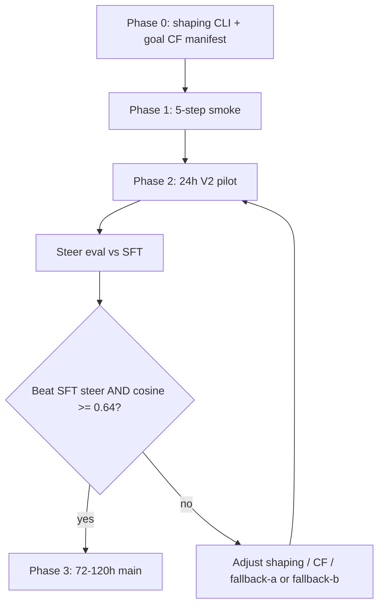

# V2 Sim-GRPO Plan (LIBERO 4-suite, V5 SFT base)

Second iteration of sim-GRPO after the **V1 pilot** (`data/grpo/libero_4suite_v5_sim_grpo_pilot/`): ~80–115 steps in 5h, 50/50 sim+recon, no KL anchor, K=4, Goal-only predicates on cross-suite CF pairs.

**V2 goal:** Train on **pure steerability reward** (sim only), use **KL** to keep the policy stable, make sim signal **denser and aligned**, and **measure steerability** — not “more steps of the same recipe.”

---

## 1. V1 postmortem (what we learned)

| Observation | Implication |
|-------------|-------------|
| Infra stable (`sim_error_frac=0`, ~60% predicate in cache) | Sim loop works; failure mode is **learning signal**, not wiring |
| `r_sim` bimodal: fail ~0.5, success ~2.6 | GRPO sim gradient only when K-rollouts **mix** outcomes |
| `sim_predicate_pos_frac` ~0.5 flat | No train-time trend; not evidence of improvement |
| Val `closed_greedy/cosine` **0.615** @ step 50 vs SFT **~0.668** | Recon **drift** without KL; sim fights similarity |
| Recon-only GRPO also weak | Default recipe under-trains or wrong LR; sim path still right *direction* |
| ~2.5 min/step, 8 rollouts/step | **~500 steps ≈ 21h**, **~2000 ≈ 3.5d** — step count alone is expensive |
| V4 CF-filtered ~200 steps: cosine ~0.46→0.47 | Longer V1-style runs **do not** automatically recover SFT quality |

**Verdict:** V1 reward is **not literally zero** on failure (dense shaping exists) but **too sparse for GRPO** because the predicate dominates and within-mode variance is tiny. **Scaling steps without V2 changes is low ROI.**

---

## 2. V2 success criteria (hold these before scaling wall-clock)

Primary (steerability — what we actually want), via
`scripts/eval/run_grpo_steer_holdout.sh` → `grpo_steer_scorecard.json`:

1. **Held-out CF steer eval (publishable):** `delta_predicate_rate_grpo_minus_sft` ≥ **+10pp** on the frozen held-out slice from `scripts/training/build_grpo_cf_eval_manifest.py`. The slice is episode-stratified with the same `seed` / `held_out_fraction` as `run_grpo.py`, so train activations cannot appear in eval.
2. **Stability guardrail (not trained):** `closed_greedy/cosine` stays **≥ 0.64** (within ~0.03 of V5 SFT) — monitored on val; **KL anchor** provides the training-time stabilizer, not recon in the reward.
3. **Semantic causality:** `semantic_gap_predicate` (matched − mismatched_source intent arm) **> 0** on GRPO AV — otherwise the gains are non-semantic vector hacks, which is not a "language steers VLA" claim.

Secondary (sanity, **diagnostics only — not paper headlines**):

4. `sim_error_frac < 0.01`, `sim_active_frac = 1.0` with CF manifest filter.
5. Train `sim_reward_mean` / shaping terms show **spread** (not only 0.5 vs 2.6 clusters) — see §4.1.
6. `sim_predicate_pos_frac` from `grpo.log` and aggregates from `sim_reward_cache.jsonl` are **wiring sanity checks**. The cache is leaky, mixes seeds, and is **not** evidence of beat-SFT or generalization. See `scripts/eval/aggregate_sim_cache.py` (banner: diagnostic only).

**Fail fast:** If a **24h Phase B** run does not beat SFT on (1), do not launch multi-day Phase C. If (2) violates (cosine collapse / unstable text), fall back to an **ablation arm** (§3.B) before changing the main hypothesis.

---

## 2b. V2 main arm — pure steerability reward

**Default for all Phase 1–3 runs:**

| Knob | V2 main |
|------|---------|
| `sim_reward_weight` | **1.0** (recon reward weight **0** in blend) |
| `judge_reward_weight` | **0** |
| `disable_kl_anchor` | **false** (KL **on**) |
| `beta` | **0.03** |

GRPO advantages come **only** from z-scored `r_sim` (predicates + shaping). Recon MSE is still computed for diagnostics but **does not** enter the reward. Judge is off.

**Fallback ablations** (only if main arm collapses or is unstable — cosine **< 0.62**, nonsense rollouts, or `sim_error_frac` spikes):

| Arm | When | Config |
|-----|------|--------|
| **V2-fallback-a** | Language/recon drifting badly | `sim_reward_weight=0.75`, recon implicit **0.25**, KL **on** |
| **V2-fallback-b** | OOM with ref AV | `sim_reward_weight=0.8`, `--disable-kl-anchor`, recon **0**; watch cosine every 50 steps |

Do **not** start with fallback arms; they exist to recover stability, not to replace the pure-steer objective.

---

## 3. V2 design pillars

### Pillar A — Denser sim signal (code + config)

**Problem:** `w_predicate=2.0` makes `r_sim` almost binary; GRPO needs within-group spread.

**Changes:**

| Knob | V1 pilot | V2 default | Rationale |
|------|----------|------------|-----------|
| `w_predicate` | 2.0 (fixed) | **1.0** | Predicate still matters; shaping can differentiate failures |
| `w_dist` / `w_displace` / `w_contact` | 0.5 / 0.3 / 0.2 | **0.8 / 0.5 / 0.3** | Stronger continuous signal on partial progress |
| Expose weights via CLI | No | **Yes** (`--sim-w-predicate`, etc.) | Ablations without code edits |

**Implementation:** Add optional args to `run_grpo.py` → thread into `rollout.py` / `predicates.score()` (or pass breakdown weights in rollout JSON). ~1 small PR.

**Optional:** Log `r_dist`, `r_displace`, `r_contact` means in `metrics.jsonl` for dashboards.

### Pillar B — Pure sim reward + KL anchoring (main arm)

| Knob | V1 pilot | V2 main |
|------|----------|---------|
| `sim_reward_weight` | 0.5 | **1.0** |
| `judge_reward_weight` | 0 | **0** |
| Recon in reward blend | 0.5 | **0** |
| `disable_kl_anchor` | on (OOM) | **off** (KL **on**) |
| `beta` (KL) | 0.0 | **0.03** (range 0.02–0.05) |
| `learning_rate` | ~3e-6 | **1e-5** with warmup 50 steps |

**OOM only:** `B=2`, `K=4`, `--disable-kl-anchor`, keep `sim_reward_weight=0.8` or **1.0** with recon **0** — prefer **fallback-b** over mixing recon into the reward unless cosine collapses (then **fallback-a**).

### Pillar C — Better groups for GRPO variance

| Knob | V1 pilot | V2 default |
|------|----------|------------|
| `rollouts-per-activation` (K) | 4 | **8** when wall-clock allows (2× sim cost, more mixed groups) |
| `batch-size` (B) | 2 | **2** (keep; VRAM) |
| `rollout-temperature-high` | 1.6 | **1.6** (keep diversity) |
| `dynamic-sampling` | on | **on**; log `dynamic_sampling_drop_frac` |

### Pillar D — CF & scene alignment (biggest structural fix)

**Problem:** Goal-only predicates score **steered Goal task** in a **mismatched** BDDL (spatial/object/10 activations). Reward is noisy / misaligned.

**V2 track (pick one for main run, other as ablation):**

1. **Goal-only pool (fast):** `--cf-eligible-ids-path` built from pairs where `source_example_id` prefix is `goal__` only. Sim reward matches loaded scene family more often.
2. **Env-matched CF (better):** Re-mine or filter pairs so `target_env_name` BDDL contains bodies for `target_task` (use `audit_cf_pairs_sim_feasibility.py`). Prefer pairs where steered task is **feasible** in that scene.
3. **Suite-specific predicates (later):** Extend `predicates.py` beyond `GOAL_TASKS` for spatial/object/10 — larger eng surface; schedule as V2.1 if (1)+(2) insufficient.

**Mining:** Raise `--max-total` or remove cap for goal suite so CF coverage → **>80%** of eligible activations (V1 used 5k/suite ≈ 35%).

### Pillar E — Judge blend (deferred / ablation only)

**Not in the main arm.** Pure sim + KL is the default.

If Phase 2 steer is flat **and** cosine stays healthy, optional **48h ablation**:

| Knob | `V2-judge-ablation` |
|------|---------------------|
| `sim_reward_weight` | **0.80** |
| `judge_reward_weight` | **0.20** |
| Recon in reward | **0** |
| KL | **on** |

Requires `--frames-cache` and `--judge-video-keys image wrist_image`. Run only after main arm baseline exists.

### Pillar F — Evaluation cadence (not optional)

V1 only had val @ step 50. V2 **must** run:

| When | What |
|------|------|
| Every **50** train steps | In-trainer val: `closed_greedy/cosine` (+ per-position) |
| Every **100** steps | Save `av/` checkpoint |
| End of Phase B/C | **Steerability harness** on fixed CF eval slice (50–100 episodes): `success_any_rate`, predicate rate, `target_task` breakdown |
| Compare | SFT `av` + same AR/server |

Script target: wire `scripts/eval/steerability_eval.py` (or existing orchestrator hook) post-checkpoint.

---

## 4. Phased rollout

### Phase 0 — Prereqs (1 session)

- [ ] V5 SFT: `data/sft/libero_4suite_v5_base_qwen/` (cosine ~0.668)
- [ ] Steer server smoke on **5556**
- [ ] CF manifest + audits: `build_grpo_cf_manifest.py`, `audit_cf_pairs_sim_feasibility.py`
- [ ] Implement **sim shaping CLI** (Pillar A)
- [ ] `pytest tests/test_grpo_sim_reward.py tests/test_predicates.py -q`

### Phase 1 — V2 smoke (30 min wall)

**Purpose:** Same as V1 smoke; verify new weights + KL + metrics.

```bash
# Example — tune paths/ports
PYTHONPATH=src .venv/bin/python scripts/training/run_grpo.py \
  --sft-dir data/sft/libero_4suite_v5_base_qwen \
  --activations-root data/activations/libero_4suite_v4_combined \
  --output-dir data/grpo/libero_4suite_v5_sim_grpo_v2_smoke \
  --total-steps 5 --batch-size 2 --rollouts-per-activation 4 \
  --sim-reward-weight 1.0 --judge-reward-weight 0 --beta 0.03 \
  --sim-w-predicate 1.0 --sim-w-dist 0.8 \
  --cf-eligible-ids-path data/grpo/libero_4suite_cf_eligible_goal_only.json \
  ... # full sim flags as V1
```

**Pass:** `sim_error_frac=0`, `sim_active_frac=1`, metrics include shaping breakdown, no OOM.

### Phase 2 — V2 pilot (24h wall)

**Purpose:** Falsify “will it learn?” cheaper than 5× V1.

| Setting | Value |
|---------|--------|
| Wall | **24h** (`timeout 86400`) |
| Steps cap | 500 (expect ~280–320 steps) |
| K | 8 if stable, else 4 |
| Eval every | 50 |
| Save every | 100 |

**Outputs:** `data/grpo/libero_4suite_v5_sim_grpo_v2_pilot/`

**Go / no-go to Phase 3:**

- Go: predicate or steer eval **↑** vs SFT **and** cosine **≥ 0.64** (KL holding stability)
- No-go: steer flat → adjust Pillars A/D (denser shaping, CF). Cosine **< 0.62** or unstable text → try **fallback-a/b** (§2b), then retry Phase 2

### Phase 3 — V2 main (optional, 3–5d)

Only after Phase 2 go.

- **500–1000 steps** or 72–120h wall
- Full steerability eval @ 250, 500, final
- Optional **judge ablation** (Pillar E) only if main arm plateaus but cosine stayed healthy

### Phase 4 — Ablations (parallel short runs)

Run **48h max** each, same SFT init:

| Arm | Change |
|-----|--------|
| **V2-main** | **sim=1.0, judge=0, recon reward=0, KL on** + Pillars A+C+D1 |
| **V2-fallback-a** | sim=0.75, recon slack 0.25, KL on — if main collapses cosine |
| **V2-fallback-b** | sim=0.8–1.0, recon 0, KL off — OOM only |
| **V2-dense-only** | Main + predicate 0.5, shaping ↑ |
| **V2-judge-ablation** | sim 0.8 + judge 0.2, recon 0 — optional after main baseline |
| **V1-repro** | V1 pilot (sim 0.5, no KL) as control |

---

## 5. Recommended V2 default config (single manifest)

```yaml
# Logical config — map to run_grpo.py flags
sft_dir: data/sft/libero_4suite_v5_base_qwen
activations_root: data/activations/libero_4suite_v4_combined
output_dir: data/grpo/libero_4suite_v5_sim_grpo_v2

batch_size: 2
rollouts_per_activation: 8
total_steps: 500          # Phase 2; increase in Phase 3

learning_rate: 1.0e-5
beta: 0.03
disable_kl_anchor: false  # if OOM: fallback-b — KL off, sim 0.8+, recon 0

sim_reward_weight: 1.0      # pure steerability; recon blend weight 0
judge_reward_weight: 0.0    # judge ablation only (Pillar E)

sim_w_predicate: 1.0
sim_w_dist: 0.8
sim_w_displace: 0.5
sim_w_contact: 0.3

sim_n_workers: 18
sim_max_steps: 100
sim_placement: image_patch
sim_blend: 1.0
rollout_temperature_high: 1.6

dynamic_sampling: true
use_ppo_clip: false        # enable when multi-epoch per rollout exists

cf_eligible_ids_path: data/grpo/libero_4suite_cf_eligible_goal_only.json
sim_counterfactual_pairs: [goal, spatial, object, 10 jsonls]  # still load; filter ids

eval_every: 50
save_every: 100
log_every: 10
```

---

## 6. Engineering checklist

| Task | Priority | Owner |
|------|----------|-------|
| CLI for `ShapingWeights` + pass to rollout subprocess | P0 | training |
| `build_grpo_cf_manifest.py --suite goal` → goal-only manifest | P0 | data |
| `launch_v5_sim_grpo_v2_pilot.sh` (24h wrapper, V2 flags) | P0 | scripts |
| Log `sim_r_dist_mean`, `sim_r_displace_mean`, `sim_predicate_pos_frac` | P1 | grpo.py |
| Post-train steer eval hook in orchestrator | P1 | scripts |
| Suite-specific predicates (spatial/object/10) | P2 | predicates.py |
| Multi-epoch PPO per rollout (make clip useful) | P2 | grpo.py |

---

## 7. Resource estimates (V2 pilot vs V1)

| Phase | Wall | ~Steps | ~Sim rollouts |
|-------|------|--------|----------------|
| V1 pilot | 5h | ~100 | ~800 |
| V2 smoke | 0.5h | 5 | ~80 |
| V2 pilot (K=8) | 24h | ~150–180 | ~2400–2900 |
| V2 main (K=8) | 72h | ~450–550 | ~7200–8800 |

Steer server: 1 GPU (~7GB). GRPO AV: ~44GB with ref AV; ~22GB with `--disable-kl-anchor`.

---

## 8. What V2 explicitly does *not* do (defer)

- Fine-tune AR or GR00T inside this loop (still frozen; indirection remains).
- Replace predicates with learned reward model (research fork).
- Full 20k-step GRPO without Phase 2 go/no-go.
- Recon or judge in the **reward** for main runs (fallback ablations only).
- Recon-only GRPO as primary path (control arm only).

---

## 9. Decision tree



---

## 10. References

- Trainer: `src/nla/training/grpo.py`, `scripts/training/run_grpo.py`
- Sim reward: `src/nla/training/sim_reward.py`, `src/nla/eval/steerability/predicates.py`
- Ops: `docs/GRPO_AGENT_REFERENCE.md`
- V1 artifacts: `data/grpo/libero_4suite_v5_sim_grpo_pilot/`
- V5 SFT eval: `data/sft/libero_4suite_v5_base_qwen/post_sft_eval/SUMMARY.txt`
