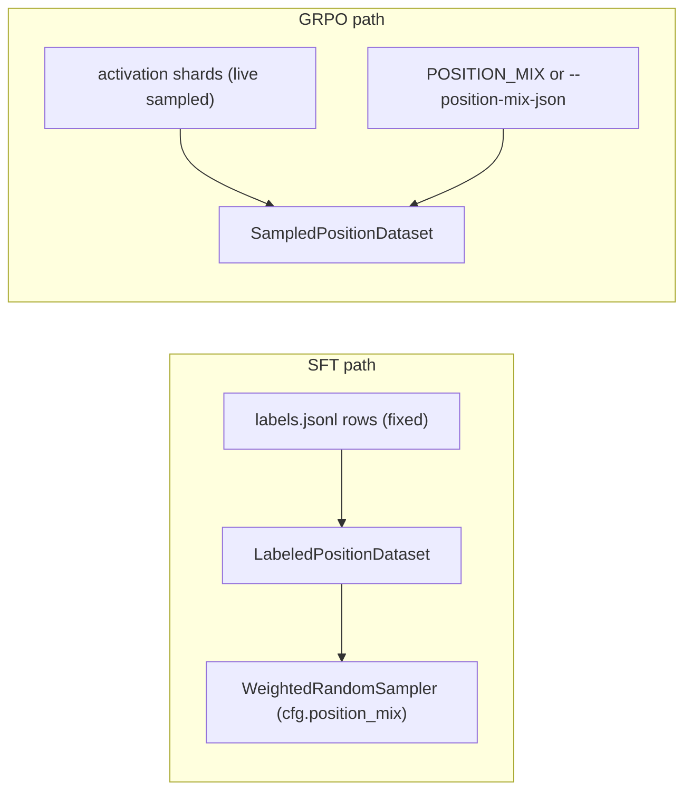

# Anchor Ablation: With vs Without the Anchor Position Type

## Question

Does the `anchor` position type carry its weight in the V4 SFT corpus,
or is it dead weight that should be dropped from labeling, SFT, and GRPO?

## What anchor is (and isn't)

`anchor` is a **position label** for one slot in GR00T's backbone token
sequence, not the prompt text. Concretely, it's the 2048-dim hidden state at
the **last non-pad token** of the prompt (usually EOS), after the model has
processed instruction and images. See
[`_anchor_index`](../../src/nla/extraction/sampler.py) and
[`POSITION_MIX`](../../src/nla/layer_spec.py).

The caption stored in `labels.jsonl` for an anchor row is GPT-labeled text
describing what the model is thinking at that final readout
position (overall plan / trajectory phase, per
[`prompts.py`](../../src/nla/labeling/prompts.py) line ~525). The thing
the AV/AR models actually train on is the **vector**.

## Why we want to ablate

Anchor has structural problems in the current corpus:

| Factor | Value | Issue |
|---|---|---|
| Anchor label rows | 166 / 101,580 (0.16%) | Tiny stratum |
| `balance_position_mix` target weight | 20% of batches | 120x oversampling of 166 rows |
| Downstream use (steering, GRPO sim, action consistency) | `image_patch` only | Anchor is trained but never used at inference |
| AR architecture | No placement input | AR cannot meaningfully separate anchor from other ptypes |

**Hypothesis:** removing anchor frees ~20% of SFT batch budget for
`last_text` / `image_patch`, and does not hurt the metrics we actually
care about. The ablation tests this empirically rather than assumes it.

## Two pipelines, two levers

SFT and GRPO touch anchor through different code paths. Both must be
controlled in Arm B.



- **SFT lever:** drop anchor rows from `labels.jsonl` AND override the
  rebalance target via `--position-mix-json '{"last_text":0.5,"image_patch":0.5}'`.
- **GRPO lever:** override `--position-mix-json` similarly. GRPO has no
  labels file; it samples positions live from the activation shards using
  the mix.

## Arms

| Arm | SFT labels | SFT position mix | GRPO position mix | Checkpoint |
|---|---|---|---|---|
| **A - with anchor** (baseline) | [`labels.jsonl`](../../data/labels/libero_4suite_v4_combined/labels.jsonl) | 40 / 40 / 20 (default) | default `POSITION_MIX` | Existing [`libero_4suite_v4_consistency_overnight`](../../data/sft/libero_4suite_v4_consistency_overnight) + the GRPO run currently in flight at [`libero_4suite_v4_sim_grpo_20260519_124923`](../../data/grpo/libero_4suite_v4_sim_grpo_20260519_124923) |
| **B - no anchor** | [`labels_no_anchor.jsonl`](../../data/labels/libero_4suite_v4_combined/labels_no_anchor.jsonl) | 50 / 50 last_text / image_patch | `{"last_text":0.5,"image_patch":0.5}` | Next SFT retrain into `data/sft/libero_4suite_v4_no_anchor`, then GRPO into `data/grpo/libero_4suite_v4_no_anchor_sim_grpo` |

**Critical:** do not touch the running GRPO job. It is the canonical Arm A.

## Files generated by the data prep step

| File | Rows | Position types after |
|---|---|---|
| [`data/labels/libero_4suite_v4_combined/labels_no_anchor.jsonl`](../../data/labels/libero_4suite_v4_combined/labels_no_anchor.jsonl) | 101,414 | last_text: 51,085  /  image_patch: 50,329 |
| [`data/activations/libero_4suite_v4_combined/hard_negatives_no_anchor.jsonl`](../../data/activations/libero_4suite_v4_combined/hard_negatives_no_anchor.jsonl) | 101,414 | last_text: 51,085  /  image_patch: 50,329 |
| [`data/labels/libero_4suite_v4_combined/labels_no_anchor.jsonl.audit.json`](../../data/labels/libero_4suite_v4_combined/labels_no_anchor.jsonl.audit.json) | n/a | Full filter summary + suite counts |

The original `labels.jsonl` and `hard_negatives.jsonl` are untouched and
remain the canonical inputs for Arm A.

Validation already passed:

- 0 remaining `position_type == "anchor"` in filtered labels
- Hard-neg file row count == labels file row count (101,414)
- 0 hard-neg negs reference an anchor-ptype label id
- Every `source_example_id` still resolves in the activation index

To regenerate from scratch:

```bash
PYTHONPATH=src python scripts/training/filter_labels_by_position.py \
  --labels-in        data/labels/libero_4suite_v4_combined/labels.jsonl \
  --labels-out       data/labels/libero_4suite_v4_combined/labels_no_anchor.jsonl \
  --hard-negatives-in  data/activations/libero_4suite_v4_combined/hard_negatives.jsonl \
  --hard-negatives-out data/activations/libero_4suite_v4_combined/hard_negatives_no_anchor.jsonl \
  --exclude anchor
```

## Code changes shipped with this ablation

| File | Change |
|---|---|
| [`scripts/training/filter_labels_by_position.py`](../../scripts/training/filter_labels_by_position.py) | New. Streams labels and hard-negs through a position-type filter and writes parallel JSONLs plus an audit JSON. |
| [`src/nla/training/sft.py`](../../src/nla/training/sft.py) | `SFTConfig.position_mix` added (default `None`, keeps legacy 40/40/20). `_position_mix_sampler` now accepts an override. |
| [`scripts/training/run_sft.py`](../../scripts/training/run_sft.py) | New flag `--position-mix-json`. Parsed identically to `run_grpo.py`'s existing flag. |
| [`configs/ablations/anchor_ablation.yaml`](../../configs/ablations/anchor_ablation.yaml) | Arm definitions, launch commands, and decision rule. |

Arm A behaviour is byte-identical to the pre-change code path: leaving
`--position-mix-json` unset reads `POSITION_MIX` from
[`layer_spec.py`](../../src/nla/layer_spec.py) exactly like before.

## Launch order (do NOT execute yet)

1. **Wait for the current GRPO run** at
   [`libero_4suite_v4_sim_grpo_20260519_124923`](../../data/grpo/libero_4suite_v4_sim_grpo_20260519_124923) to
   complete. That is Arm A's GRPO output and must remain undisturbed.
2. **Arm B SFT** - see `arm_b_sft` in
   [`configs/ablations/anchor_ablation.yaml`](../../configs/ablations/anchor_ablation.yaml).
   Same hyperparams as Arm A apart from the labels path, the hard-neg
   index path, and `--position-mix-json`. New output dir
   `data/sft/libero_4suite_v4_no_anchor`.
3. **Arm B GRPO** - see `arm_b_grpo` in the same YAML. Launched only
   after Arm B SFT finishes and the user gives the go-ahead.

## Future labeling guardrail

When re-labeling for Arm B style runs, do not pass `--guarantee-strata`
to [`run_label.py`](../../scripts/labeling/run_label.py): it reserves an
anchor slot per example in
[`src/nla/labeling/context.py`](../../src/nla/labeling/context.py). Use
`--positions-per-example 2` and let the sampler mix from
`last_text` + `image_patch` only.

## Eval and decision rule

Run the identical eval harness on both checkpoints. When Arm A metrics
include an anchor stratum, drop the anchor-only rows from cross-arm
tables (Arm B has none).

Primary metrics (pre-registered):

- `cosine/position=image_patch`
- `cosine/position=last_text`
- `closed_greedy/cosine`
- LLM judge grounding on `image_patch` + `last_text`
- `sim_correct_minus_wrong` (already `image_patch` placement)

Pre-registered decision rule (also in the YAML):

| Outcome | Action |
|---|---|
| Arm B >= Arm A on all primary metrics | Drop anchor permanently from labeling pipeline and `POSITION_MIX`. |
| Arm B worse on >= 2 primary metrics | Keep anchor slot, but invest in thousands of anchor rows before any further use. The 166-row stratum is too small to draw a conclusion against. |
| Roughly flat | Drop anchor for simplicity. The 166 rows are not earning their batch budget. |

## Why anchor probably will not help

A short, honest expectation in case the result looks lopsided. The
current pipeline never uses anchor for any downstream behaviour:

- Steering ([`run_gr00t_server_nla_steer.py`](../../scripts/eval/run_gr00t_server_nla_steer.py))
  defaults to `image_patch`.
- GRPO sim reward ([`run_grpo.py`](../../scripts/training/run_grpo.py))
  uses `--sim-placement image_patch`.
- Action consistency
  ([`sft.py`](../../src/nla/training/sft.py) action consistency knobs)
  is `image_patch_only=True` by default.

Anchor only shows up in SFT training and structured eval. Its 166 rows
get reweighted to 20% of every batch, which means each anchor example
is seen roughly 120x more often than each `image_patch` example. That
is a recipe for memorization of a tiny set without any payoff at
inference. Removing anchor frees that batch budget for ptypes that are
actually exercised downstream.

Expected outcome: Arm B is flat or slightly better on `image_patch` and
`last_text` metrics, and unchanged on sim because sim never touched
anchor in the first place. The ablation confirms the priors rather than
revealing a surprise.
