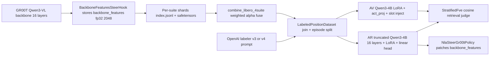

# V4 training and reconstruction audit

> Source for this document: a 10-thread read-only audit of the V3 SFT run at
> `data/sft/libero_4suite_v3/`, the activation corpus at
> `data/activations/libero_4suite_combined/`, the labels at
> `data/labels/libero_4suite_combined/labels.jsonl`, and the V4 repair docs
> under `docs/sft_plan/v4_repair/`. All claims below cite the file:line they
> came from; numbers are read directly from artifacts checked into the repo.

## 1. Executive summary

**Was V3 SFT "trained wrong"?** No obvious wiring bug — α is consistent
between AV training, AR training, and the AR evaluator (raw `h` vs `α * AR(·)`
round-trip is correct in [`src/nla/training/sft.py`](../../src/nla/training/sft.py)
at lines 412–414, [`src/nla/models/ar.py`](../../src/nla/models/ar.py) at
lines 222–227, and [`src/nla/steering/nla_vec.py`](../../src/nla/steering/nla_vec.py)
at lines 10–20). Joint loss, scheduled `ar_av_mix`, position-balanced sampler,
and the `topk_cosine` hard-negative path were all on in V3 per
[`data/sft/libero_4suite_v3/config.json`](../../data/sft/libero_4suite_v3/config.json).

**What is real:** V3's headline reconstruction is mediocre. The latest scorecard
at [`data/sft/libero_4suite_v3/v3_scorecard.json`](../../data/sft/libero_4suite_v3/v3_scorecard.json)
is **`overall: "FAIL"`** with:

- retrieval margin **PASS** (0.124, `n = 178`),
- judge grounding (axis B) **WARN** at **0.4375** for `av_pred` (`judge_n = 32`),
- judge anti-template **FAIL** at **0.25**,
- judge appropriateness **PASS** at 0.969,
- closed-loop greedy cosine **FAIL** at **0.388**,
- retrieval@1 **FAIL** at **3.93%**, retrieval@5 **FAIL** at **12.36%**,
- sim A/B **NA** (not run).

**One number that is wrong-by-implementation, not wrong-by-data:** the streaming
FVE logged in `metrics.jsonl` does **not** match the docstring in
[`src/nla/training/fve.py`](../../src/nla/training/fve.py) at lines 7–10 (per-dim
batch mean baseline). The streaming accumulator at lines 65–98 uses a **single
scalar mean over every element** as the baseline. Algebraically that baseline
is always **at least as large** as the per-dim baseline, so logged FVE is
**optimistically biased** vs the documented definition — the **−23** number
**cannot** be explained away by switching baselines (the per-dim FVE is
**≤ −23**, i.e. equal or worse). MSE and cosine in the same row remain trustworthy.

**Most likely non-label explanation for the ~0.36–0.39 cosine ceiling:**
`last_text` activations are saturated and the V3 hard-negative miner is mining
uniform noise on that half of the corpus. Agent 5's audit in
[`docs/sft_plan/v3_quality/agent5_hard_negatives.md`](../sft_plan/v3_quality/agent5_hard_negatives.md)
at lines 39–42 and 673–677 measured mean mined cosine ≈ **0.9989** for
`last_text` (random same-ptype pairs already at **0.9592**, so mining gains
**+0.04** — effectively shuffle noise). That defeats the InfoNCE term on roughly
**half** the corpus before any caption-quality question is asked.

**Goal of V4 (in priority order):**

1. **Make eval honest** (fix FVE definition; explicitly label the two retrieval
   regimes; keep cosine and judge B as primary).
2. **Fix the contrastive geometry** (per-ptype mining, drop saturated
   `last_text` `topk_cosine`, raise effective batch).
3. **Land V4 labels** (V4 prompt; spatial pilot already shows +85pp axis B on
   the worst 34 spatial rows, [`docs/sft_plan/v4_repair/sa2_spatial_pilot.md`](v4_repair/sa2_spatial_pilot.md)
   at lines 3 and 44).
4. **Re-train SFT** with stronger NCE batch + `ar_av_mix` retained.
5. **Validate steerability causally** (offline Δaction + sim A/B), not just
   higher cosine.
6. **Reserve GRPO** for after steps 1–5 ship a clean V4 SFT.

## 2. Data pathway and how reconstruction happens



### 2.1 Extraction

`backbone_features` is the **output of decoder layer `SELECT_LAYER - 1 = 15`**
(0-indexed), **before** `vlln` and `vl_self_attention`, shape `[B, T, 2048]`,
captured by a forward hook on `policy.model.backbone` and **promoted to fp32**
for storage. See [`src/nla/extraction/hook.py`](../../src/nla/extraction/hook.py)
at lines 5–11 and 123–138, [`src/nla/layer_spec.py`](../../src/nla/layer_spec.py)
at lines 25–28 and 44–46, and
[`scripts/extraction/run_extract.py`](../../scripts/extraction/run_extract.py)
at lines 274–279 and 291–294. There is **no** intermediate-layer extraction —
the only hook is the final surviving block.

### 2.2 Alpha (α)

α is the 75th-percentile L2 norm over valid token positions
([`src/nla/extraction/stats.py`](../../src/nla/extraction/stats.py) at lines
37–46 and 113–125). The V3 combined corpus α is **203.977** from
[`data/activations/libero_4suite_combined/stats.json`](../../data/activations/libero_4suite_combined/stats.json),
but that file is **not** recomputed from the merged reader — it is a
**`n_positions`-weighted average of per-suite percentiles** per
[`scripts/training/combine_libero_4suite.py`](../../scripts/training/combine_libero_4suite.py)
at lines 219–243. Per-suite α values differ (e.g. `libero_goal` α = 206.345
in [`data/activations/libero_4suite_stride2/libero_goal/stats.json`](../../data/activations/libero_4suite_stride2/libero_goal/stats.json)).
This is a small but real approximation, documented as such in the fuse code.

### 2.3 Corpus shape and sampling stride

`manifest.json` records `step_stride = 2` and 4 suites fused; the bundled
extractor shell uses `--steps-per-traj 60` so each trajectory contributes
**steps 0, 2, …, 58 only** (see
[`scripts/extraction/run_extract_all_libero_suites.sh`](../../scripts/extraction/run_extract_all_libero_suites.sh)
at lines 29–50 and the index rows). Per-suite counts in
`per_suite_num_examples` are `[12840, 12960, 13620, 11370]` for goal/spatial/object/10,
totaling **50,790** examples. Odd timesteps and late-episode states are
**never sampled** under this configuration — a coverage cap, not a bug.

### 2.4 Label join and split

[`src/nla/training/dataset.py`](../../src/nla/training/dataset.py) joins labels
to activations on `meta.source_example_id` (lines 201–214, 272–273); missing
matches are dropped with a warning (276–284). `split_by="episode"` groups by
`ExampleRecord.episode_index` (**from the activation index, not the label**),
lines 72–118; if `episode_index` is `None` everywhere it falls back to a row
split with a warning (84–99). `strict_position_check=True` (default) catches
`position_index >= seq_len` at init time but **does not** catch semantic
misalignment (frame off-by-one).

Position-type counts in `labels.jsonl`:

| `position_type` | rows  |
|-----------------|------:|
| `last_text`     | 51,085 |
| `image_patch`   | 50,329 |
| `anchor`        |    166 |

`anchor` is **two orders of magnitude rarer** than the others, and
`balance_position_mix: true` in V3 means the sampler is replaying these few
rows heavily — possible source of overfit on the `anchor` stratum (where the
retrieval@1 is 0.75 with only n=8, a noise-dominated number).

### 2.5 Hard negatives (training-side)

V3 used `ar_nce_hard_negative_source: "topk_cosine"`,
`ar_nce_hard_negatives_per_anchor: 4`, and the file at
`data/activations/libero_4suite_combined/hard_negatives.jsonl`
(see [`data/sft/libero_4suite_v3/config.json`](../../data/sft/libero_4suite_v3/config.json)
lines 100–103). Mining ran **without** `--per-position-type` in V3, so
negatives mined for an `image_patch` anchor could include `last_text`
captions — different geometry, weak contrast. Val datasets in
[`sft.py`](../../src/nla/training/sft.py) at lines 269–279 do **not** pass
hard-negative kwargs, so val NCE uses random in-batch negatives only.

## 3. SFT training recipe in human terms

### 3.1 Loss decomposition

Per step in [`src/nla/training/sft.py`](../../src/nla/training/sft.py) at
lines 483–537:

```
L = q * ( w_av * CE_AV_gold  +  w_ar * ( MSE_AR_alpha  +  [w_nce>0] * w_nce * NCE_AR_cosine ) )
```

where:

- `CE_AV_gold` is teacher-forced cross-entropy on the **gold** caption with
  the activation injected at one slot embedding (after L2-norm + α scaling in
  [`av.py`](../../src/nla/models/av.py) at lines 216–221).
- `MSE_AR_alpha` is MSE between AR's prediction and `h / α`
  ([`ar.py`](../../src/nla/models/ar.py) at lines 222–227); targets are
  optionally clipped to ±5 (`clip_target_scaled = 5.0` in V3).
- `NCE_AR_cosine` is cross-entropy over a `(B, B + K_neg)` cosine similarity
  matrix at temperature 0.1, labels = diagonal
  ([`ar.py`](../../src/nla/models/ar.py) at lines 242–256).
- `q` is `quality_weight` averaged over the batch (off in V3, always 1).

### 3.2 What learns from what

| Module / parameter         | Gets gradients from                                                                 |
|----------------------------|-------------------------------------------------------------------------------------|
| AV (LoRA + `act_proj`)     | `CE_AV_gold` only — **no** gradient from AR or from `av.generate` (no_grad) |
| AR (LoRA + `head`)         | `MSE_AR_alpha`, and `NCE_AR_cosine` when `ar_contrastive_weight > 0`                |
| Base Qwen3-4B weights      | Frozen except via LoRA                                                              |

This is important: **SFT does not have a direct gradient that pushes AV to
produce text AR can invert** — that's the AV/AR distribution-gap risk. V3 uses
`ar_av_mix_max = 0.4` with `ar_av_mix_warmup_frac = 0.3` (lines 90–94 of
config) to mitigate by **showing AR AV-generated text** on some batches after
step 4500; AV CE always trains on gold. Metrics rows confirm `p_av` ramps
post-warmup and `ar_mix_used = 1` appears around step 5125.

### 3.3 V3 hyperparameters (verbatim from config)

- `batch_size: 4`, `grad_accum_steps: 1`, `total_steps: 15000`, `warmup_steps: 500`
- `learning_rate: 1e-4`, weight decay 0, grad clip 1.0
- `av_weight: 1.0`, `ar_weight: 1.0`, `ar_contrastive_weight: 0.5`
- `ar_av_mix_max: 0.4`, `ar_av_mix_warmup_frac: 0.3`
- `ar_cfg.clip_target_scaled: 5.0`, `ar_cfg.nce_temperature: 0.1`
- `truncate_to_n_layers: 16`, `lora_rank: 32`, `lora_alpha: 64`, `lora_dropout: 0.05`
- `balance_position_mix: true`, `min_bullet_lines: 3`
- `split_by: episode`, `held_out_fraction: 0.05`, `max_val_items: 1000`

### 3.4 Levers most likely to lift cosine (ranked, with caveat that this is
ordering by expected impact, not a substitute for an ablation grid)

1. **Larger effective NCE batch** (`batch_size * grad_accum_steps`) so each
   anchor sees more in-batch negatives.
2. **Better hard negatives** — per-ptype mining, drop `last_text` from
   `topk_cosine`, tighten Jaccard cap per
   [`sa8_hardneg_miner.md`](v4_repair/sa8_hardneg_miner.md) at lines 113–139.
3. **Keep `ar_av_mix_max > 0`** (V3 had 0.4 — keep).
4. **Higher LoRA rank** for AR (or a small full-FT comparison) once data is
   clean.
5. **Tune NCE temperature** per ptype if separate scales remain
   ([`agent5_hard_negatives.md`](../sft_plan/v3_quality/agent5_hard_negatives.md)
   line 677).
6. **Longer training / different LR decay tail** — only after the above; LR
   schedule is warmup + half-cosine in [`sft.py`](../../src/nla/training/sft.py)
   at lines 320–324.

## 4. Eval critique — what to trust and what to fix

### 4.1 Confirmed bug: streaming FVE baseline

[`src/nla/training/fve.py`](../../src/nla/training/fve.py):

- Docstring (lines 7–10): `FVE = 1 - sum((y - y_hat)^2) / sum((y - y_bar)^2)`
  where `y_bar` is **per-dimension** batch mean.
- `fve_per_token` (lines 32–50) matches the docstring (`target.mean(dim=0)`).
- `_StreamingFve.update / compute` (lines 74–98) uses a **single scalar mean**
  over all elements: `mean = self.sum / self.n_elements`, then
  `ss_tot = self.sum_sq - self.n_elements * mean * mean`. This is the variance
  baseline for **predicting one global scalar**, not the per-dimension batch
  mean vector.

Algebra: `SS_global = SS_per_dim + sum_d B*(mu_d - mu)^2 ≥ SS_per_dim`.
Therefore `FVE_global ≥ FVE_per_dim` for the same `ss_res`. So **the logged
FVE is optimistically biased**; switching to the docstring definition would
give an equal-or-more-negative number, never an equal-or-better one.

Practical implication: **the V3 −23.59 FVE is a real "much worse than naïve
baseline" number even under the streaming approximation**, but you cannot
take `1 - mse / Var(h)` algebra to compare against it — the denominator is a
sum of squared deviations, not a variance. `mse` and `cosine` from the same
row are not affected by this bug and remain trustworthy.

### 4.2 Retrieval metrics

[`scripts/eval/closed_loop_retrieval.py`](../../scripts/eval/closed_loop_retrieval.py)
at lines 197–246 computes an `N x N` cosine matrix between raw `h` and
α-rescaled AR predictions on **held-out** rows; `retrieval@k` is the fraction
where the matched (diagonal) rank is ≤ k.

- The **overall** pool is mixed across position types; the **by_position**
  pool is restricted within type.
- `retrieval_at_5` for `anchor` is 1.0 with `n=8` — saturated by `min(5, m)`
  rule (line 245). Treat `anchor` numbers as **n-too-small** signals.
- Random baseline for `N=178` is `k/N` → `@1 ≈ 0.56%`, `@5 ≈ 2.8%`. The
  thresholds **0.25 / 0.55** are realistic targets, well above chance, and
  V3 is far below them.

`v3_scorecard.json` overall logic in
[`build_v3_scorecard.py`](../../scripts/eval/build_v3_scorecard.py) at lines
360–373 fails if **any** required row fails. Required rows when sim is absent:
`retrieval_margin`, `judge_grounding_specific_pct`, `judge_anti_template_specific_pct`
(lines 120–124). V3 fails on the third one (`0.25 < 0.30`).

### 4.3 Closed-loop cosine and the AV/AR gap

`closed_greedy_cosine` (0.388) is **slightly higher** than teacher-forced AR
cosine on gold (0.364) on the V3 final row of `metrics.jsonl`. That is a tell:
if AR were the only bottleneck and gold captions were the ceiling, gold→AR
should beat AV-greedy→AR. The proximity says **template collapse is at play**
— AV's greedy output and gold both pass through an AR that has co-adapted to
templates, so the round-trip is not strongly discriminative. The V2 postmortem
warned about exactly this in
[`docs/sft_plan/06_v2_postmortem_v3_rerun.md`](06_v2_postmortem_v3_rerun.md)
at lines 11–34.

### 4.4 Qualitative read of `av_samples.jsonl`

Reading [`data/sft/libero_4suite_v3/av_samples.jsonl`](../../data/sft/libero_4suite_v3/av_samples.jsonl)
directly:

- Many `image_patch` generations repeat the same "black bowl on ramekin near
  the white plate" scaffold across unrelated tasks (e.g. a ketchup-and-basket
  scene gets described as a bowl scene). This is template collapse.
- `last_text` greedy generations on instruction-anchored rows ("open the top
  drawer …") track the instruction reasonably; sampled (`t=0.7`) generations
  swap the target object plausibly (wine bottle → cabinet) while keeping the
  same skeleton.
- `appropriateness` (axis C) is 96.9% PASS because the **format and tone** are
  right; grounding (axis B) is 43.75% WARN because the **scene content** is
  wrong on roughly half of `av_pred` rows.

### 4.5 Things to retire or rename

- **Rename or fix `_StreamingFve`**. Either accumulate per-dim sums (so the
  online formula matches the docstring) or compute `fve_per_token` over
  concatenated val tensors at eval end. See §6 for the chosen plan.
- **Stop treating `closed_greedy_cosine: FAIL` as a no-op in the scorecard**
  — currently informational (see `INFORMATIONAL` list in
  [`build_v3_scorecard.py`](../../scripts/eval/build_v3_scorecard.py) at
  lines 131–139). It is the single most decision-relevant number for V4 and
  should be required.
- **Document the random baseline** next to retrieval@k in the scorecard so
  pass/warn bands are calibrated to `N`, not eyeballed.

## 5. Steerability — what cosine buys and what it does not

`ActivationReconstructor.predict(unscale=True)` returns `pred_scaled * α` (raw
backbone units, [`ar.py`](../../src/nla/models/ar.py) at lines 175–178);
`ar_text_to_backbone_vec` wraps that ([`nla_vec.py`](../../src/nla/steering/nla_vec.py)
lines 10–20). The steer hook in
[`backbone_steer.py`](../../src/nla/steering/backbone_steer.py) at lines 121–144
writes `(1-λ) * h + λ * ĥ` at the chosen token positions; `λ ≥ 1` is hard
replace and `λ` is silently clipped to `[0, 1]`.

**Cosine improvement on val helps steering only when**:

- The AR was trained on activations from **the same embodiment / checkpoint**
  you are steering. The V3 AR is trained on
  `libero_4suite_combined` extracted from a LIBERO GR00T checkpoint, so it
  should be in-distribution for LIBERO sim — but
  [`steerability_v1_vs_v3.yaml`](../../scripts/eval/steerability_v1_vs_v3.yaml)
  at lines 101–106 already uses this AR as the matched arm vs an OOD v1 AR.
- The **placement** matches a token type the AR saw at training time —
  `image_patch` is the safest default for vision-grounded prompts; `anchor`
  is what `nla_steer_quant_probe.py` uses; `image_patch_all` is the largest
  lever but the most disruptive (steerability_v1.yaml uses this by default).
- The **prompt format** mirrors `render_ar_prompt` from labeling.

**Cosine improvement does not buy**:

- A guarantee that the action head will respond — that's a separate causal
  question, measured by `nla_steer_groot_action.py` (offline Δaction) and the
  closed-loop sim wrapper.
- Generalization to a new robot / suite if AR was not re-trained on those
  activations ([`docs/evals/sim_steer_rollout.md`](../evals/sim_steer_rollout.md)
  "Honest caveat", lines 149–170).

**Implication for V4**: cosine and judge B are necessary but not sufficient.
Plan must include offline Δaction + closed-loop sim A/B as the **acceptance
test for steerability**, not just metric movement.

## 6. Top false-progress risks for V4 (ranked) and tripwires

| Rank | Risk | Symptom | Source | Mitigation |
|-----:|------|---------|--------|------------|
| 1 | Template / shorthand collapse | Cosine and FVE look fine; judge B and qualitative samples bad | [`06_v2_postmortem_v3_rerun.md`](06_v2_postmortem_v3_rerun.md) lines 11–34 | Run judge + qualitative every checkpoint; require axis B as scorecard gate |
| 2 | `last_text` saturation + junk hard negs | Train NCE ticks; per-ptype `last_text` retrieval@1 ≈ 1% | [`agent5_hard_negatives.md`](v3_quality/agent5_hard_negatives.md) lines 39–42, 673–677 | Re-mine with `--per-position-type --last-text-strategy random_same_ptype --jaccard-cap 0.55 --top-k 8` per [`sa8_hardneg_miner.md`](v4_repair/sa8_hardneg_miner.md) lines 113–139 |
| 3 | Gold vs AV text distribution mismatch | Teacher-forced > closed-loop; `p_av` stays 0 | [`06_v2_postmortem_v3_rerun.md`](06_v2_postmortem_v3_rerun.md) lines 17–34 | Keep `--ar-av-mix-max ≥ 0.3` with ramp; consider GRPO + `ar_co_train` after V4 SFT |
| 4 | Judge / sim skipped, scorecard looks better than reality | Overall WARN with judge_n = 0 (was true earlier today, now repaired) | scorecard config block | Judge + retrieval are CI gates before any "ship V4" claim |
| 5 | V3+V4 corpus blend leaks V3 motor-imperative scaffolding | SA3 motor gate stays RED | [`sa6_relabel.md`](v4_repair/sa6_relabel.md) lines 124–157 | Prefer Option A full relabel (~$57); if budget-bound, accept WARN on motor gate and document it |
| 6 | Retrieval margin passes while retrieval@1 stays low | Margin > 0.05 but @1 < 5%; "we have a signal but it's not discriminative" | V3 scorecard | Promote retrieval@1 and/or closed_greedy_cosine to required gates |
| 7 | Small batch makes NCE noisy | `ar_nce` plateau near `ln(B)` | [`agent5_hard_negatives.md`](v3_quality/agent5_hard_negatives.md) line 677 | Raise `batch_size * grad_accum_steps` to ≥ 16 effective; sweep |
| 8 | Steering AR off-distribution at deployment | Sim A/B differences within noise; large baseline-vs-steer Δaction but inconsistent | [`docs/evals/sim_steer_rollout.md`](../evals/sim_steer_rollout.md) lines 149–170 | Confirm AR's activation corpus matches sim checkpoint; sweep `placement` and `blend` |

**Tripwires for V4 CI / monitoring** (add or schedule before V4 SFT starts):

1. **`metrics.jsonl` rail** — every checkpoint, run
   [`scripts/ci/check_sft_metrics.py`](../../scripts/ci/check_sft_metrics.py)
   with `--require-closed-loop` and an `--max-tf-closed-fve-gap`. Alert when
   training `ar_nce` is within ε of `ln(batch_size)` (NCE collapse).
2. **Hard-negative preflight** — re-run
   [`scripts/eval/audit_hard_negatives.py`](../../scripts/eval/audit_hard_negatives.py)
   after any label-merge or activation re-extract; fail if `last_text` median
   top-1 cosine stays in `[0.95, 1.0]` while using `topk_cosine`.
3. **Pinned qualitative panel** — every eval, dump 32 samples with
   [`scripts/eval/dump_av_samples.py`](../../scripts/eval/dump_av_samples.py)
   on a **fixed seed** and run a small (~50 row) judge slice; alert when
   axis B for `av_pred` drops more than 5 pp run-over-run.

## 7. V4 upgrade plan (concrete, ordered)

This is the actionable plan. Steps 1–3 are cheap and unblocking. Steps 4–7 are
the expensive runs and require explicit go-ahead (compute, OpenAI spend, sim
access).

### Step 1 — Fix FVE definition (now, code change, this PR)

In [`src/nla/training/fve.py`](../../src/nla/training/fve.py), change
`_StreamingFve` to accumulate per-dimension sums:

- Replace scalar `sum`, `sum_sq` with `sum_per_dim: torch.Tensor`,
  `sum_sq_per_dim: torch.Tensor`, both shape `[H]`, lazily allocated on the
  first `update`.
- Replace `ss_tot = sum_sq - n_elements * mean^2` with
  `ss_tot = (sum_sq_per_dim - sum_per_dim.pow(2) / n_rows).sum().item()`,
  where `n_rows` is the per-dimension count (each row contributes one sample
  per dim).
- `mse = ss_res / n_elements` and `cosine = cos_sum / n_rows` stay unchanged.

Also expose a `dim_fixed` flag (or just bump the metric keys to `fve_pd` for
"per-dim") so the V3 baseline rows in `metrics.jsonl` aren't mixed apples-to-
oranges with V4. Update [`docs/sft_plan/03_eval_harness.md`](03_eval_harness.md)
to point readers at the corrected definition. Note in
[`06_v2_postmortem_v3_rerun.md`](06_v2_postmortem_v3_rerun.md) that "FVE"
numbers before the fix used the global-scalar-mean baseline.

### Step 2 — Tighten the scorecard (small code change, same PR or next)

In [`scripts/eval/build_v3_scorecard.py`](../../scripts/eval/build_v3_scorecard.py):

- Move **`closed_greedy_cosine`** and **`retrieval_at_1`** into `REQUIRED_FOR_PASS_*`
  (currently only informational). This makes "WARN with FAIL on key informational
  metrics" stop being possible.
- Add a `random_baseline = k / N` field next to retrieval@k for documentation.
- Stop accepting `judge_n = 0` as a pass-by-default for required judge rows
  (currently returns `None` → `NA` → forces overall WARN); make a missing
  judge artifact a **build error**, not a silent skip.

### Step 3 — Re-mine hard negatives (cheap; the only step executed in this PR)

Ran:

```bash
PYTHONPATH=src python scripts/training/mine_hard_negatives.py \
    --activations-root data/activations/libero_4suite_combined \
    --labels-jsonl     data/labels/libero_4suite_combined/labels.jsonl \
    --out              data/activations/libero_4suite_combined/hard_negatives_v4.jsonl \
    --per-position-type \
    --top-k 8 \
    --jaccard-cap 0.55 \
    --last-text-strategy random_same_ptype \
    --min-bullet-lines 3 \
    --device cuda --dtype float32
```

Output: [`data/activations/libero_4suite_combined/hard_negatives_v4.jsonl`](../../data/activations/libero_4suite_combined/hard_negatives_v4.jsonl)
(101,580 anchors, K=8, ran in ~8 minutes on one GPU). The audit lives at
[`data/activations/libero_4suite_combined/hard_negatives_v4_audit.md`](../../data/activations/libero_4suite_combined/hard_negatives_v4_audit.md).

**Headline numbers** (from the audit on 500 sampled anchors + 500 random
same-ptype pairs):

| ptype         | mined mean cos | random same-ptype mean cos | mining contrast | strategy |
|---------------|---------------:|---------------------------:|---------------:|---------|
| `image_patch` | 0.958          | 0.749                       | **+0.21**       | `topk_cosine` |
| `last_text`   | 0.960          | 0.959                       | +0.00           | `random_same_ptype` (intentional) |
| `anchor`      | n/a            | 0.961                       | (n=166; noise)  | `topk_cosine` |

This matches the SA8 smoke result at
[`docs/sft_plan/v4_repair/sa8_hardneg_miner.md`](v4_repair/sa8_hardneg_miner.md)
lines 100–110 within rounding. **Interpretation**:

- `image_patch` now has **+0.21 mining contrast** vs random pairs (V3 mining
  mixed ptypes, so this signal was diluted). That's the term that should
  actually move InfoNCE during V4 SFT.
- `last_text` has zero mining contrast **by design** (the activation
  geometry doesn't separate episodes there — see
  [`agent5_hard_negatives.md`](v3_quality/agent5_hard_negatives.md) lines
  39–42). Using `random_same_ptype` stops the trainer from learning that
  fake-hard noise is "informative."
- `anchor` is statistically noisy (166 rows); not worth interpreting in
  isolation.

The audit script's overall verdict is still **RED** because the absolute
mined-cosine band is `[0.6, 0.95]` and the per-ptype numbers sit at ~0.96.
This is the activation-geometry limit on this corpus; the only known fix
is the deferred "earlier-layer extraction" work in
[`sa8_hardneg_miner.md`](v4_repair/sa8_hardneg_miner.md) lines 140–143. For
V4, accept the absolute-cosine RED and rely on the **+0.21 image_patch
contrast** to drive contrastive learning.

**Caveat to an earlier claim:** the audit doc previously said the re-mine
was the "single largest expected lift for retrieval@1 / cosine on
`image_patch`." After running it, the more honest framing is: the re-mine
**unlocks** meaningful InfoNCE on `image_patch` (a precondition for that
lift), but the actual cosine lift will only show up after a fresh SFT
consumes the new file via `--ar-nce-hard-negative-index-path`.

### Step 4 — V4 labels (large, paused on budget per
[`sa6_relabel.md`](v4_repair/sa6_relabel.md))

The V4 prompt pipeline is wired and tested
([`sa5_pipeline_wiring.md`](v4_repair/sa5_pipeline_wiring.md)) and the V4
labeler is queued for 82,005 rows at ~$57 (Option A in
[`sa6_relabel.md`](v4_repair/sa6_relabel.md) line 226). Recommendation:
**Option A full relabel** for the suites the spatial pilot showed the largest
lift (+85pp axis B on the worst 34 spatial rows,
[`sa2_spatial_pilot.md`](v4_repair/sa2_spatial_pilot.md) lines 3 and 44). If
budget-constrained, **Option B** with documented motor-gate WARN. Run via:

```bash
PYTHONPATH=src python scripts/labeling/run_v4_relabel.py \
    --queue-dir data/labels/v4_relabel_queue \
    --out-dir   data/labels/libero_4suite_v4 \
    --concurrency 32 \
    --cost-cap 70
```

(See [`sa6_relabel.md`](v4_repair/sa6_relabel.md) lines 201–215 for the
driver contract.)

Followed by merging V3-kept + V4-rewritten rows into a single
`data/labels/libero_4suite_v4_merged/labels.jsonl` (SA7 work — currently
blocked on SA6 output).

### Step 5 — V4 SFT (~14 GPU-hours like V3)

Suggested launch from a fixed seed for direct A/B vs V3:

```bash
PYTHONPATH=src python scripts/training/run_sft.py \
    --activations-root data/activations/libero_4suite_combined \
    --labels-jsonl     data/labels/libero_4suite_v4_merged/labels.jsonl \
    --stats-json       data/activations/libero_4suite_combined/stats.json \
    --output-dir       data/sft/libero_4suite_v4 \
    --base-model       Qwen/Qwen3-4B-Instruct-2507 \
    --ar-layers        16 \
    --lora-rank        32 \
    --dtype            bfloat16 \
    --batch-size       4 \
    --grad-accum-steps 4 \
    --learning-rate    1e-4 \
    --warmup-steps     500 \
    --total-steps      15000 \
    --av-weight        1.0 \
    --ar-weight        1.0 \
    --ar-contrastive-weight 0.5 \
    --ar-nce-hard-negative-source     topk_cosine \
    --ar-nce-hard-negatives-per-anchor 4 \
    --ar-nce-hard-negative-index-path data/activations/libero_4suite_combined/hard_negatives_v4.jsonl \
    --ar-av-mix-max         0.3 \
    --ar-av-mix-warmup-frac 0.3 \
    --balance-position-mix \
    --min-bullets 3 \
    --split-by   episode \
    --eval-every 500 \
    --save-every 2500 \
    --eval-closed-loop --closed-loop-temps 0.0 0.7 --closed-loop-max-batches 64 \
    --max-val-items 1000 \
    --seed 0
```

Two changes vs V3 that matter most:

1. `--grad-accum-steps 4` raises effective NCE batch from 4 to 16 (4× the
   negatives per anchor) at constant memory.
2. New `hard_negatives_v4.jsonl` (per-ptype, capped Jaccard, no fake
   `last_text` `topk_cosine`).

Optional ablation arms to launch in parallel if compute permits:

- `v4_largebatch`: same as above but `--batch-size 8 --grad-accum-steps 2`.
- `v4_nomix`: `--ar-av-mix-max 0` to confirm the mix is helping rather than
  hurting cosine.
- `v4_higherlora`: `--lora-rank 64` if AR capacity looks bottlenecked after
  metrics fix.

### Step 6 — V4 evaluation (mandatory gates)

After the run:

```bash
# closed-loop retrieval + AR cosine
PYTHONPATH=src python scripts/eval/closed_loop_retrieval.py \
    --ckpt-dir         data/sft/libero_4suite_v4 \
    --activations-root data/activations/libero_4suite_combined \
    --labels-jsonl     data/labels/libero_4suite_v4_merged/labels.jsonl \
    --n-samples 256 --batch-size 8 --seed 0

# multimodal judge (axis B + anti-template + appropriateness)
export OPENAI_API_KEY=...
PYTHONPATH=src python scripts/eval/llm_judge_av_captions.py \
    --ckpt-dir         data/sft/libero_4suite_v4 \
    --activations-root data/activations/libero_4suite_combined \
    --labels-jsonl     data/labels/libero_4suite_v4_merged/labels.jsonl \
    --frames-cache     data/labels/libero_4suite_combined/frames_cache \
    --video-keys       image wrist_image \
    --per-position     12 \
    --concurrency      8 \
    --out-jsonl        data/sft/libero_4suite_v4/llm_judge.jsonl

# scorecard
PYTHONPATH=src python scripts/eval/build_v3_scorecard.py \
    --ckpt-dir data/sft/libero_4suite_v4
```

**Gate for V4 = PASS**: scorecard overall **PASS**, with `closed_greedy_cosine`
and `retrieval_at_1` promoted to required (see Step 2). Concrete primary
targets, calibrated to V3 baseline:

- teacher-forced AR cosine overall: **> 0.50** (V3: 0.364)
- `image_patch` cosine: **> 0.45** (V3: 0.327)
- closed-greedy cosine: **> 0.50** (V3: 0.388)
- retrieval@1 overall: **> 0.20** (V3: 0.039)
- retrieval margin: **> 0.20** (V3: 0.124)
- judge axis B (`av_pred`): **> 0.55** (V3: 0.4375)
- judge anti-template (`av_pred`): **> 0.50** (V3: 0.25)

### Step 7 — Steerability validation (after Step 6 passes)

Pre-flight (offline, single GR00T process, no sim):

```bash
PYTHONPATH=src python scripts/eval/nla_steer_groot_action.py \
    --model-path     checkpoints/GR00T-N1.7-LIBERO/libero_goal \
    --dataset-path   third_party/Isaac-GR00T/examples/LIBERO/libero_goal_no_noops_1.0.0_lerobot \
    --embodiment-tag LIBERO_PANDA \
    --ar-dir         data/sft/libero_4suite_v4/ar \
    --traj-id 0 --step 50 \
    --placement image_patch --blend 1.0 \
    --text-file prompts/steer_pickup_bottle.txt \
    --out-json data/eval/v4_steer_offline.json
```

Sweep over `placement ∈ {image_patch, anchor, image_patch_all}` and
`blend ∈ {0.25, 0.5, 1.0}`. Require non-trivial `|Δaction|` vs baseline that
**also** varies across prompt A vs prompt B
([`nla_steer_quant_probe.py`](../../scripts/eval/nla_steer_quant_probe.py)).

Closed-loop sim (two-terminal flow per
[`docs/evals/sim_steer_rollout.md`](../evals/sim_steer_rollout.md)):

```bash
# Terminal A — server with V4 AR
PYTHONPATH=src python scripts/eval/run_gr00t_server_nla_steer.py \
    --model-path        checkpoints/GR00T-N1.7-LIBERO/libero_goal \
    --embodiment-tag    LIBERO_PANDA \
    --use-sim-policy-wrapper \
    --ar-dir            data/sft/libero_4suite_v4/ar \
    --steer-text-file   prompts/steer_pickup_bottle.txt \
    --placement         image_patch \
    --blend             1.0 \
    --port 5555

# Terminal B — LIBERO rollout client (libero_uv venv)
gr00t/eval/sim/LIBERO/libero_uv/.venv/bin/python \
    gr00t/eval/rollout_policy.py \
    --n-episodes 20 \
    --policy-client-host 127.0.0.1 \
    --policy-client-port 5555 \
    --max-episode-steps 720 \
    --env-name libero_sim/put_the_bowl_on_the_plate \
    --n-action-steps 8 \
    --n-envs 5
```

Baseline = same client, server with `--steer-off`. **Required**: at least one
prompt where success rate or trajectory class differs significantly from the
baseline arm. Capture via the harness:

```bash
PYTHONPATH=src python scripts/eval/steerability_eval.py \
    --config scripts/eval/steerability_v4.yaml
```

A `steerability_v4.yaml` should be authored as a clone of
[`steerability_v1_vs_v3.yaml`](../../scripts/eval/steerability_v1_vs_v3.yaml)
with `ar_dirs: [data/sft/libero_4suite_v4/ar]`.

### Step 8 (optional) — GRPO if SFT plateaus

Reserve this for **after** V4 SFT lands and steerability is confirmed.
Reconstruction-only GRPO can reinforce template collapse (postmortem §3 in
[`06_v2_postmortem_v3_rerun.md`](06_v2_postmortem_v3_rerun.md) lines 81–88),
so add the judge reward path if running GRPO:

```bash
PYTHONPATH=src python scripts/training/run_grpo.py \
    --sft-dir          data/sft/libero_4suite_v4 \
    --activations-root data/activations/libero_4suite_combined \
    --output-dir       data/grpo/libero_4suite_v4 \
    --batch-size 4 --rollouts-per-activation 8 \
    --beta 0.02 \
    --total-steps 1000 \
    --eval-every 100 --save-every 250 \
    --eval-max-examples 128 --eval-temperatures 0.0,0.7 \
    --ar-co-train-weight 0.1 \
    --judge-reward-weight 0.3 \
    --frames-cache data/labels/libero_4suite_combined/frames_cache \
    --judge-video-keys image wrist_image
```

Cost is ~5–30× SFT per step; budget accordingly.

## 8. Open questions

- **Is `last_text` saturation a layer choice or a fundamental property of the
  truncated 16-layer backbone?** Repo defers the "mine `last_text` from an
  earlier hidden layer" fix
  ([`sa8_hardneg_miner.md`](v4_repair/sa8_hardneg_miner.md) lines 140–143).
  An earlier-layer extraction experiment is worth a measurement once V4 SFT
  is shipped.
- **Should `anchor` be removed from `POSITION_MIX` until it has more rows?**
  Current rate is 166 vs ~51k for the other two, and `balance_position_mix`
  is on — `anchor` rows get replayed heavily by `WeightedRandomSampler`.
- **Does `min_bullet_lines: 3` discard `image_patch` more than `last_text`?**
  Worth a one-off count.
- **What's the right policy on judge sample size?** V3 has `judge_n = 32`;
  the WARN/FAIL bands are tight relative to that sampling noise. Consider
  `--per-position 24` for V4 evaluation to halve the variance.
- **Are V3's per-suite α gaps (e.g. 206.345 vs 203.977) large enough to matter?**
  Probably not for SFT but worth recomputing α from the joint distribution
  once with a single `compute_stats()` over the merged reader and comparing.

---

**Document scope**: read-only audit. No file changes were made while
authoring this document; the FVE fix and scorecard tightening called out in
§7 will land in follow-up commits.
