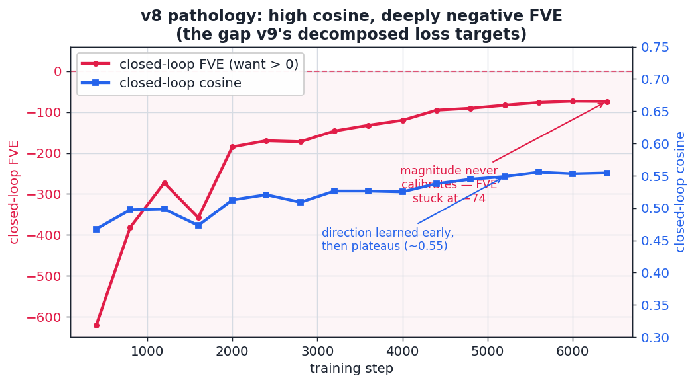
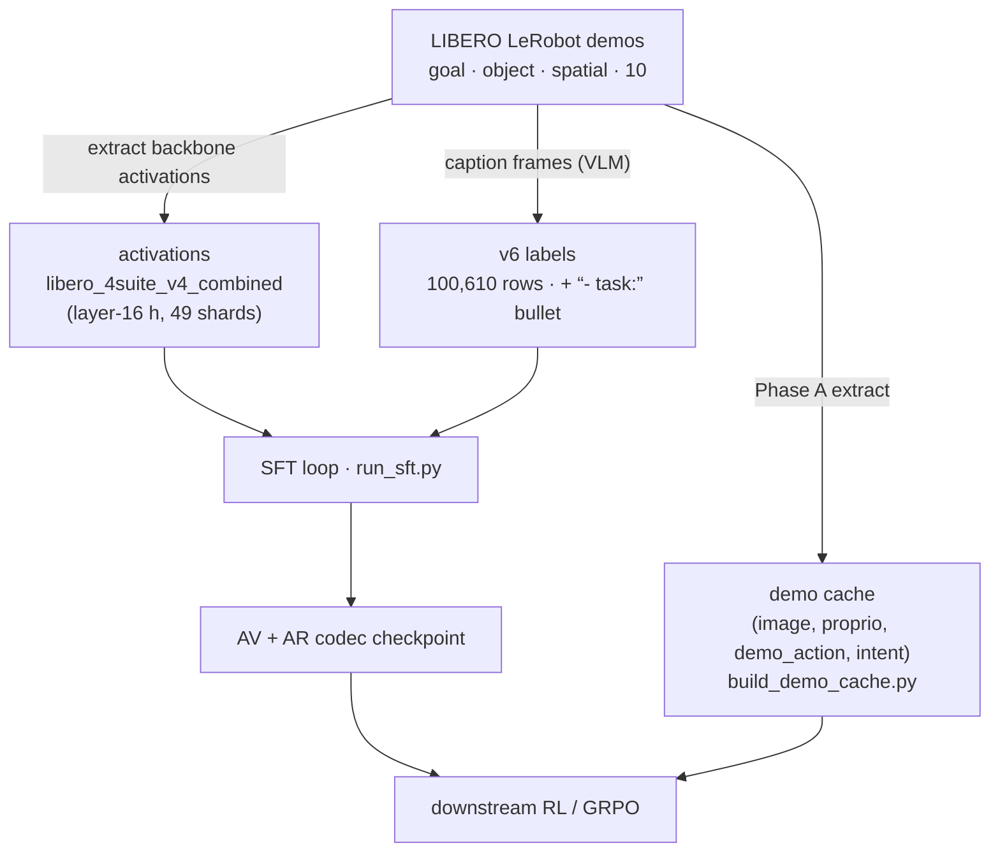
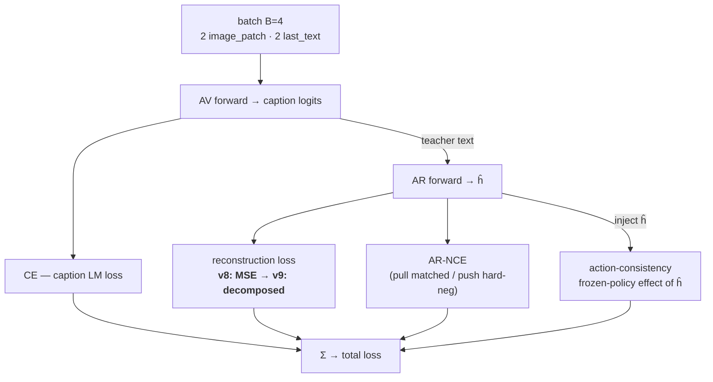
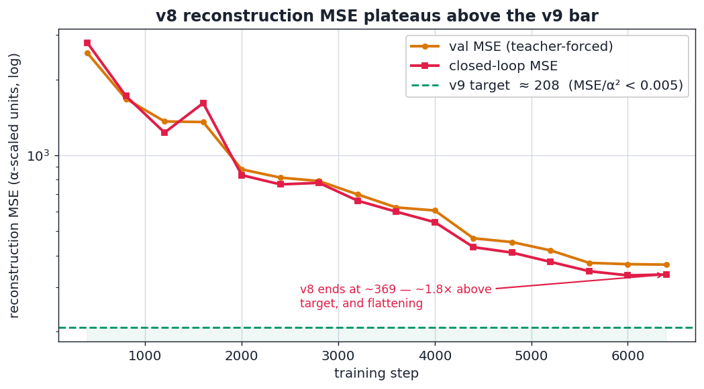
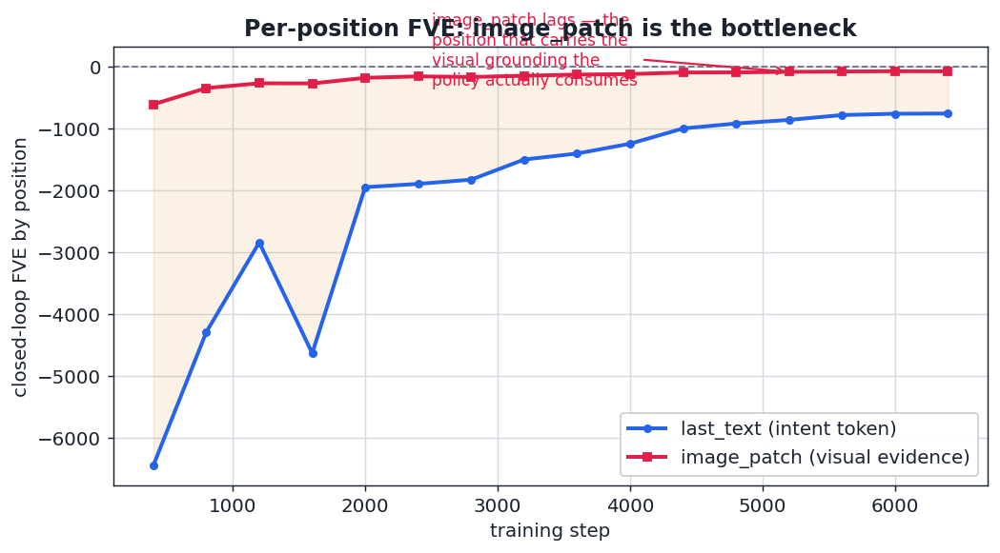
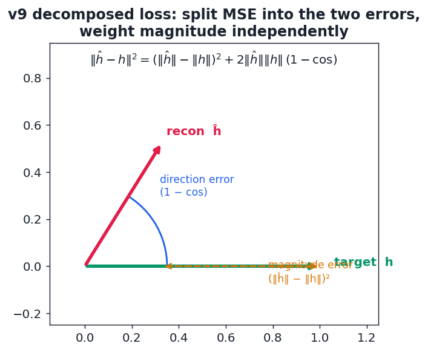

# NLA-GR00T — v9 Implementation

> **What this is.** A code-level implementation map of the NLA-GR00T codec as it
> stands at **v9**: how the pieces fit, what each training signal does, and the
> two surgical changes v9 makes to fix the pathology v8 ended in. Quantitative
> charts are drawn from the **real** [`v8_full_6400`](../../data/sft/v8_full_6400)
> run (regenerate with [`scripts/eval/plot_v9_implementation_charts.py`](../../scripts/eval/plot_v9_implementation_charts.py)).
>
> Companion docs: [v9_overview.txt](v9_overview.txt) (design rationale) ·
> [v9_runbook.md](v9_runbook.md) (operational launch) · [v7_overview.txt](v7_overview.txt) (axes & eval).

---

## TL;DR

NLA ("natural-language activations") makes the GR00T policy **steerable through
English** by routing a hidden activation through a language bottleneck and back:

```
h  ──AV──▶  intent text  ──AR──▶  ĥ  ──(×α, inject)──▶  frozen GR00T policy ──▶ action
```

Swap the text → get a different `ĥ` → the policy acts differently. The whole
research program is about making that `ĥ` a vector the policy **actually
responds to**.

**v9 = v8 + two one-line levers**, both targeting reconstruction *magnitude*:

1. **`--ar-layers 0`** — stop truncating the AR to 16 layers; use the full
   Qwen3-4B. More capacity on the reconstruction map.
2. **`--ar-loss-mode decomposed --ar-scale-weight 0.1`** — split the MSE into a
   direction term and a magnitude term so the optimizer can be *told* that
   magnitude is what's broken.

Why: v8 learned **direction** (cosine ≈ 0.55) but never calibrated **magnitude**
(closed-loop FVE stuck at −74). The chart that defines the whole problem 👇



---

## 1. System architecture

The codec is an **autoencoder whose latent is English**. Two separately-trained
LoRA heads on Qwen3-4B sit on either side of a text bottleneck; the frozen
GR00T VLA is the downstream consumer.

```mermaid
flowchart LR
    H["hidden activation h<br/>2048-d · GR00T backbone layer 16<br/>(Cosmos-Reason2-2B)"]
    AV["<b>AV</b> — Activation Verbalizer<br/>Qwen3-4B + LoRA<br/>activation → English"]
    T["intent text<br/>“put the bowl on the plate …”"]
    AR["<b>AR</b> — Activation Reconstructor<br/>Qwen3-4B + LoRA<br/>text → ĥ (2048-d)"]
    HH["ĥ  (reconstruction)"]
    POL["<b>frozen GR00T policy</b><br/>vision-language-action"]
    ACT["steered action chunk"]

    H -->|"inject at prompt slot, ×α"| AV --> T --> AR --> HH
    HH -->|"×α · inject at image_patch slots"| POL --> ACT

    classDef trained fill:#dbeafe,stroke:#2563eb,color:#1e3a8a;
    classDef frozen fill:#fee2e2,stroke:#e11d48,color:#7f1d1d;
    class AV,AR trained;
    class POL frozen;
```



- **AV** ([src/nla/models/av.py](../../src/nla/models/av.py)) — embeds one 2048-d
  activation into a `<<ACTIVATION_SLOT>>` token of a fixed prompt (project →
  L2-normalize → ×α), then autoregressively **verbalizes** what that activation
  encodes. α ≈ **203.977** (the p75 activation L2 norm).
- **AR** ([src/nla/models/ar.py](../../src/nla/models/ar.py)) — reads text and
  **reconstructs** the 2048-d vector. This is the head v9 changes.
- **Steering** ([src/nla/steering/](../../src/nla/steering/)) — at inference the
  reconstructed `ĥ` is injected back into the policy's residual stream at the
  **image_patch** positions; the policy treats it as visual evidence.

The bottleneck being *language* is the point: it's interpretable and editable.
The cost is that two lossy hops (`h→text`, `text→ĥ`) must compose to something
the policy still reads as in-distribution — which is exactly where magnitude
calibration matters.

---

## 2. Data pipeline



| Artifact | Path | Role |
|---|---|---|
| Activations | [data/activations/libero_4suite_v4_combined](../../data/activations/libero_4suite_v4_combined) | AR/AV **targets** — frozen layer-16 hidden states |
| v6 labels | [data/labels/libero_4suite_v6_with_task](../../data/labels/libero_4suite_v6_with_task) | 100,610 rows; the `- task:` bullet is load-bearing (without it codecs come out inert) |
| Hard negatives | `hard_negatives_v5.jsonl` | AR-NCE contrastive set (4/anchor) |
| Demo cache | `data/demo_cache/libero_4suite_v6` | (image, proprio, 16-step demo_action, intent) for RL — see [build_demo_cache.py](../../scripts/training/build_demo_cache.py) |

Position composition is 50 % `image_patch` / 50 % `last_text`, enforced per
batch (2 + 2 of 4) by `batch_stratified_positions`.

---

## 3. The training signal

Each SFT step runs the codec end-to-end and sums four losses. v9 touches only
the **reconstruction** term.



**Why reconstruction quality is hard to read.** A high cosine can hide a broken
norm. v8's reconstruction MSE fell steadily but **plateaued ~1.8× above the
healthy band**, and the per-position split shows `image_patch` — the position
the policy actually consumes — lagging worst:





`closed_greedy/*` (closed-loop, greedy-decoded AV→AR) is the honest metric: it
feeds the AV's *own* text into the AR instead of teacher-forcing ground-truth
captions, mirroring inference.

---

## 4. What v9 changes

### 4a. `--ar-layers 0` — full-depth AR

v8 truncated the AR to 16 transformer layers, a memory/speed default inherited
from v3 — **not** an architectural law. The AR is a *separate* Qwen3-4B; its
depth is a free hyperparameter, unrelated to the layer-16 source of the targets.
`truncate_to_n_layers=0` is the "no truncation" sentinel
([ARConfig](../../src/nla/models/ar.py)), doubling AR depth and ~20 % more LoRA
params — betting capacity is part of the magnitude bottleneck.

### 4b. Decomposed reconstruction loss — the core lever

Plain MSE already *contains* both error types, but multiplicatively coupled:

$$\|\hat h - h\|^2 \;=\; \underbrace{(\|\hat h\| - \|h\|)^2}_{\text{magnitude}} \;+\; \underbrace{2\,\|\hat h\|\,\|h\|\,(1-\cos)}_{\text{direction}}$$

When direction is already decent (cos ≈ 0.55) the cosine factor **damps** the
magnitude gradient — so the optimizer can't push norms into place without
disturbing direction. v9 **decouples** them:



```python
# src/nla/models/ar.py  (ar_loss_mode == "decomposed")
p_norm = p.norm(dim=-1).clamp_min(eps)
t_norm = t.norm(dim=-1).clamp_min(eps)
cos    = (p * t).sum(dim=-1) / (p_norm * t_norm)
dir_loss   = (1.0 - cos).mean()                                   # pure direction
scale_loss = (torch.log(p_norm) - torch.log(t_norm)).pow(2).mean()  # scale-invariant magnitude
return dir_loss + float(cfg.ar_scale_weight) * scale_loss
```

The magnitude term is a **log-norm-ratio** (over- and under-shoot penalized
equally, scale-invariant). `--ar-scale-weight` (default **0.1**) is the dial:
0.3–0.5 if norms stay off after a few hundred steps; 0.05 if direction starts
collapsing. The legacy `mse` mode stays byte-identical, so v8 runs reproduce
exactly.

| | v8 | v9 | mechanism |
|---|---|---|---|
| AR depth | 16 layers | **full (≈36)** | more reconstruction capacity |
| Recon loss | `mse` | **`decomposed`** | un-couple magnitude from direction |
| `ar_scale_weight` | n/a | **0.1** | independent magnitude gradient |
| step time | ~6 s | ~9–12 s | full AR depth |

### Expected movement (from [v9_overview.txt](v9_overview.txt) §3 — *projected*)

| metric | v8 final | v9 expected | note |
|---|---|---|---|
| closed-loop cosine | 0.556 | 0.55–0.60 | small drop OK |
| closed-loop MSE | 347 | 120–220 | **headline** |
| closed-loop FVE | −76 | −10 → +0.2 | **headline** — clear 0 |
| `steer_lift` | unknown | +0.05 → +0.20 | *iff* magnitude was the bottleneck |

---

## 5. Launch & gates

Canonical detached launch (full flags in [v9_runbook.md](v9_runbook.md) §"Single-command launch"):

```bash
export PYTHONPATH=src
setsid nohup .venv/bin/python -u scripts/training/run_sft.py \
  --recipe v7 \
  --labels-jsonl data/labels/libero_4suite_v6_with_task/labels.jsonl \
  --ar-spatial-n-positions 128 --image-patch-pooling-strided-k 128 --av-num-image-slots 128 \
  --ar-layers 0 --ar-loss-mode decomposed --ar-scale-weight 0.1 \
  --total-steps 6400 --eval-every 400 \
  --output-dir data/sft/v9_<run> \
  > data/sft/v9_<run>_launch.log 2>&1 < /dev/null &
```

**Acceptance** (v9-specific, on top of the three CF steering predicates):

```
closed_greedy/fve > 0.0          # v8 ended at −76; beating the per-dim mean
val MSE / α²       < 0.005        # ≈ 200 raw units; v8 was ~350
```

Then the standard gate chain: action-effect probe → random-vector control →
spatial probe → CF sim eval → GRPO (gated on `steer_lift > 0`).

---

## 6. Status

- **v9 run**: [`data/sft/v9_full_4k`](../../data/sft/v9_full_4k) is launched
  (config + AV/AR dirs present; metrics not yet flowing) — the first run to
  exercise `--ar-layers 0 --ar-loss-mode decomposed`.
- **Charts** above regenerate from real metrics via
  [`scripts/eval/plot_v9_implementation_charts.py`](../../scripts/eval/plot_v9_implementation_charts.py)
  — rerun once v9 produces a `metrics.jsonl` to overlay v9 vs v8.

> If v9 closes the FVE gap **and** moves `steer_lift > 0`, the headline flips
> from "direction-only codec" to **"calibrated codec"** — a cleaner claim that
> language genuinely steers the VLA.
