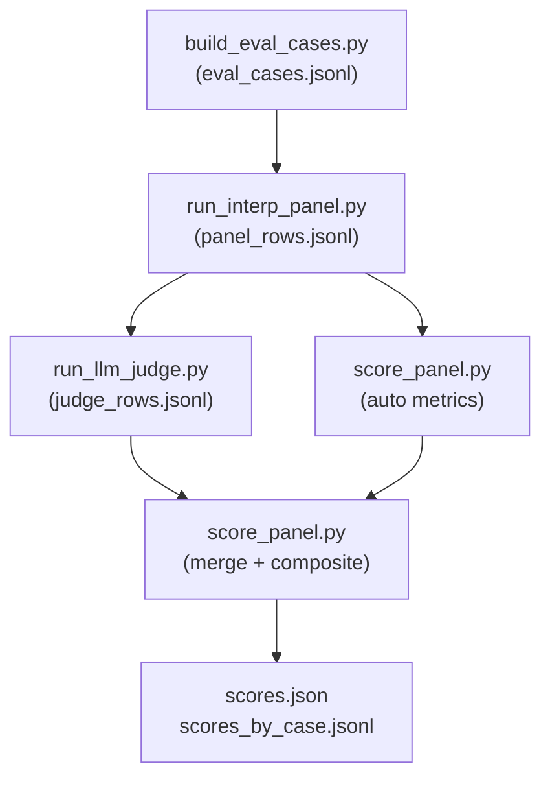
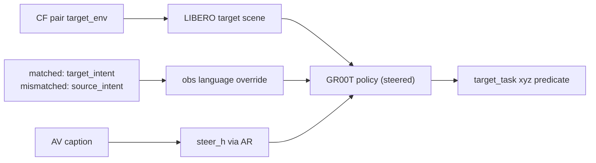

# Interpretability Evaluation Protocol

> **Two tracks:** (1) **SFT / scene grounding** — caption vs **camera** (`llm_judge_av_captions.py`, axes B/C); (2) **Interp panel** below — caption behavior under **counterfactual `h` edits**. Do not conflate them; see **`docs/evals/v2_lessons_learned.md`**, **`07_sft_recipe_dataset_agnostic.md`**.

**Project:** `nla-groot` — AV/AR on GR00T activations (`PYTHONPATH=src`). High **FVE** does not substitute for track (1); that is the main **V2** lesson.

This document is the runbook for the structured interpretability evaluation
pipeline. It describes **what** is being measured, **how** to run the
end-to-end pipeline, and **how** to read the resulting numbers.

The pipeline lives entirely under `scripts/eval/` and consists of five
scripts plus this protocol and `judge_prompt.md`.

---

## What we are evaluating

We score **interpretability claims** — not raw FVE, not just judge vibes.
Each evaluation case is a single (example, token) position where we have:

- An original activation `h` from the GR00T backbone.
- A pre-registered hypothesis describing what the AV should say about `h`
  and how its description should change under a specific counterfactual edit.
- A control: a random matched-magnitude perturbation that should *not*
  produce the same change.

For each case we collect three AV explanations (baseline / edited / control)
and compute deterministic metrics + a constrained LLM-judge rubric. The
final composite score is a weighted blend of the two.

### Claim taxonomy (paper-shaped)

| Claim                       | Captured by                                  |
| --------------------------- | -------------------------------------------- |
| **Faithfulness (causal)**   | `direction_match`, `normalized_effect_size` |
| **Specificity**             | rubric `specificity_0_3`                     |
| **Robustness / Stability**  | `seed_stability` over paraphrase samples     |
| **Confabulation control**   | rubric `confabulation_0_3` + verbatim quote validation |
| **Counterfactual response** | rubric `consistency_0_3`, `direction_match` |

---

## File-flow diagram



What scores what:

- **Deterministic auto metrics** (machine, no LLM):
  `direction_match`, `normalized_effect_size`, `seed_stability`. These are
  the strict scientific signal — every paper figure with error bars uses
  these.
- **LLM-as-judge** (structured, anchored):
  scores rubric dimensions (`specificity`, `consistency`, `confabulation`,
  `overall_faithfulness`) against the **anchored bins** in `rubric.py` and
  must quote evidence verbatim.
- **Composite**: `composite = w_auto * auto_score + w_judge * judge_score`
  (defaults `0.7 / 0.3` — auto-metric-dominant by design).

---

## Pre-registration

Before any AV/AR change can be claimed in the paper, you must:

1. Freeze the eval set once: `python scripts/eval/build_eval_cases.py ...`
   produces `eval_cases.jsonl` and you commit it (or hash it).
2. Hand-edit the per-case `hypothesis` and `expected_direction` fields, then
   freeze again.
3. Only then run the panel + judge + score. Re-running with the same seeds
   reproduces the same case set and the same auto metrics bit-for-bit.

If you change the eval set you start over with a new file name; never edit
in place.

---

## Reproducibility guarantees

| Source of variance        | Pinned by                                   |
| ------------------------- | ------------------------------------------- |
| Case sampling             | `--seed` on `build_eval_cases.py`           |
| Token-position selection  | Same `TokenPositionSampler(seed=...)` used  |
| Counterfactual edit noise | `--seed` on `run_interp_panel.py` (torch RNG) |
| Swap partner pairing      | `--swap-seed` on `run_interp_panel.py`      |
| AV decoding               | `--greedy` recommended for the eval row     |
| LLM judge                 | `temperature=0`, `seed=<arg>`, JSON schema  |
| Auto metric math          | Pure Python on materialized vectors         |

The judge model itself is *not* fully deterministic across deployments; that
is why the judge weight defaults to 0.3 and the auto-metric weight is 0.7.

---

## End-to-end runbook

The four scripts share an output directory. Pick one and stick to it:

```bash
EVAL_DIR=runs/eval/groot_av_v1
mkdir -p "$EVAL_DIR"
```

### 1. Freeze the eval set

```bash
python scripts/eval/build_eval_cases.py \
  --activations-root data/activations/libero_goal_pilot \
  --out "$EVAL_DIR/eval_cases.jsonl" \
  --n-cases 16 \
  --seed 0
```

Then **manually** edit `hypothesis` / `expected_direction` per row (or write
a one-shot script that fills them from your task DSL). Commit / archive the
result.

### 2. Run the intervention panel

```bash
python scripts/eval/run_interp_panel.py \
  --cases "$EVAL_DIR/eval_cases.jsonl" \
  --activations-root data/activations/libero_goal_pilot \
  --av-dir runs/sft/groot_av_v1/av \
  --ar-dir runs/sft/groot_av_v1/ar \
  --out "$EVAL_DIR/panel_rows.jsonl" \
  --max-new-tokens 80 \
  --greedy \
  --n-stability-samples 2 \
  --seed 0
```

This loads the AV (and optionally AR) and writes one row per case with
baseline + edited + control explanations and the auto-metric inputs.

### 3. Run the LLM judge

```bash
export OPENAI_API_KEY=...
python scripts/eval/run_llm_judge.py \
  --cases "$EVAL_DIR/eval_cases.jsonl" \
  --panel "$EVAL_DIR/panel_rows.jsonl" \
  --out "$EVAL_DIR/judge_rows.jsonl" \
  --model gpt-4o-2024-08-06 \
  --seed 0
```

For dual-judge agreement add `--dual-judge-model <other-model>`. Use
`--resume` if a run is interrupted.

### 4. Aggregate

```bash
python scripts/eval/score_panel.py \
  --cases "$EVAL_DIR/eval_cases.jsonl" \
  --panel "$EVAL_DIR/panel_rows.jsonl" \
  --judge "$EVAL_DIR/judge_rows.jsonl" \
  --out-by-case "$EVAL_DIR/scores_by_case.jsonl" \
  --out-summary "$EVAL_DIR/scores.json" \
  --w-auto 0.7 --w-judge 0.3
```

`scores.json` is the file you cite in the paper. `scores_by_case.jsonl` is
the per-case audit trail.

---

## Reporting format (for the paper / appendix)

For each evaluation table report:

- **Mean and std** of `composite`, `auto_score_01`, `judge_score_01` across
  all cases.
- **Per-stratum means** by `position_type` (`last_text` / `image_patch` /
  `anchor`).
- **Per-edit-kind means** (`noise` / `swap` / `null` / `paraphrase`).
- `judge_agreement` (mean inter-judge agreement, when dual-judge).
- `confabulation_score` (fraction of judge quotes that survived verbatim
  validation).
- Number of failed cases (`n_failed`) if any.

A single-row "headline" should always include the auto-metric mean
**separately** from the judge mean — never collapse them so reviewers can
audit which signal is doing the work.

---

## Failure modes to watch for

- **Direction match near 0 across all cases**: the AR isn't sensitive to the
  text difference between baseline and edited. Either AR is undertrained or
  the edit is too small.
- **High judge score but low auto score**: the judge likes the prose but the
  AR can't reconstruct the predicted shift. Suspect confabulation.
- **High `seed_stability` (~1.0)**: AV is deterministic regardless of input —
  re-check that injection is actually happening (this is the failure mode
  the paper warned about).
- **Many dropped quotes (`_warnings`)**: judge invented evidence. Treat the
  judge's score for that case as low-trust.

---

## Pass/fail bands (suggested)

These are starting points, not absolutes; tune as you accumulate data:

| Composite | Meaning                                                   |
| --------- | --------------------------------------------------------- |
| ≥ 0.70    | Strong: edit is detectable and the explanation is faithful |
| 0.55-0.70 | Acceptable: most signals positive, paper-grade with caveats |
| 0.40-0.55 | Weak: report as honest negative result                    |
| < 0.40    | Failed; do not claim interpretability for this regime     |

---

## CF sim-steer headlines (publishable rules)

The closed-loop counterfactual steer track (sim-GRPO, V2 plan) has its own
headline rules. Reviewers conflate metrics easily here; keep them explicit.

**Do not report as a headline:**

- `sim_predicate_pos_frac` from GRPO training logs (in-batch, noisy).
- Aggregate `sim_reward_cache.jsonl` rates (mixed train cache, no held-out
  guarantee; see `scripts/eval/aggregate_sim_cache.py` — marked diagnostic).
- LIBERO native `success_any` on cross-scene CF rollouts (the loaded BDDL
  task is not what you steered for).
- Any predicate rate without naming it as an **xyz-heuristic on
  `target_task`** rather than LIBERO success.
- Compare JSONs whose top-level `eval_protocol` is `legacy` — the
  matched / mismatched_source intent arms share the env's BDDL
  `task_description`, so `semantic_gap_predicate` there is structurally
  near zero and is not evidence one way or the other.

**Do report as a headline:**

- `delta_predicate_rate_grpo_minus_sft` on the held-out CF slice from
  `scripts/eval/compare_cf_steer_checkpoints.py`.
- `semantic_gap_predicate` (matched − mismatched_source intent arm) — proves
  language is doing semantic work, not just norm injection. Requires
  `eval_protocol=language_swap` (the new default) to be meaningful.
- `steer_lift_predicate` (matched/semantic − matched/no_steer) — proves
  the steer adds reward over the unsteered base policy. Pairs with
  `semantic_gap_predicate` for a complete "is steering helping AND is
  language causal?" claim.
- `causal_specificity_predicate` (semantic − matched_null) and
  `placement_specificity_predicate` (semantic − wrong_placement) — proves
  the AR vector and its trained placement are causally specific.
- `closed_greedy/cosine` from GRPO `metrics.jsonl` (recon guardrail; NOT a
  steer metric — never report it alone as evidence of steering).

### Eval protocol (eval-v2: `language_swap`)

The compare and holdout scripts default to `--eval-protocol language_swap`.
Under that protocol each intent arm overrides the policy obs language
slot (`obs["language"][...]`) with the arm-specific intent text:



The simulator still loads the target BDDL scene unchanged. The only
per-arm differences flow through (a) the AV caption's `steer_h` and
(b) the language override. That makes the `semantic_gap_predicate`
(matched − mismatched) a measurement of "does what the policy is
told to do actually matter?" The legacy protocol (`eval_protocol=legacy`)
fed both arms the same BDDL `task_description`, so it could not
distinguish them.

The `no_steer` causal arm sends `options['steer_disabled']=True` to the
steer wrapper, which short-circuits to the base policy. Compared
to the `matched/semantic` arm, `steer_lift_predicate = matched/semantic
− matched/no_steer` is the publishable "the steer is adding value at
all" claim.

**One-shot runner:**
`scripts/eval/run_grpo_steer_holdout.sh` builds the held-out manifest,
runs compare with full arm matrix, and emits
`grpo_steer_scorecard.json` via `scripts/eval/build_grpo_steer_scorecard.py`.
Cite the scorecard JSON in the paper; never raw `sim_predicate_pos_frac`.

### Two-tier eval protocol (use the right one for the question)

The launcher accepts `EVAL_TIER` to switch between a fast go/no-go screen
and the full publishable matrix. Per-sample job batching (one
`worker.compute()` call per sample) makes both tiers materially faster
than the pre-2026-05 one-rollout-per-subprocess loop.

| Tier | `EVAL_TIER` | Samples | Arms | Rollouts | When to use |
|------|-------------|---------|------|----------|-------------|
| Screen | `screen` | 32 | `matched` × `semantic,no_steer` | 128 | Go/no-go on a new GRPO checkpoint; quick sweeps; checks `steer_lift_predicate` early. |
| Publishable | `publishable` (default) | 64 | full matrix incl. `no_steer` | 1024 | Headline scorecard for paper / V2 plan §2 success criteria. |

```bash
# Fast screen (~30-45 min):
EVAL_TIER=screen bash scripts/eval/run_grpo_steer_holdout.sh

# Full publishable scorecard (~4 h after Phase 1 batching):
EVAL_TIER=publishable bash scripts/eval/run_grpo_steer_holdout.sh
```

**Rule:** only spend the publishable budget if the screen shows a
non-negative `delta_predicate_rate_grpo_minus_sft` trend (or audit
intent). A flat / negative screen at 32 samples is unlikely to flip on
a full 64.

### Multi-checkpoint sweeps: skip duplicate SFT rollouts

Sweeping GRPO steps 50/100/200 against the same SFT baseline re-runs the
SFT half of every job — wasted compute. Capture SFT once, reuse it:

```bash
# First run: produce the SFT cache as a side-effect.
WRITE_SFT_CACHE=data/eval/grpo_steer_holdout/sft_baseline_arms.json \
  bash scripts/eval/run_grpo_steer_holdout.sh
# Subsequent runs against new GRPO checkpoints: skip SFT sim.
REUSE_SFT_FROM=data/eval/grpo_steer_holdout/sft_baseline_arms.json \
GRPO_AV_DIR=data/grpo/.../av/step_100 \
OUT_DIR=data/eval/grpo_steer_holdout_step_100 \
  bash scripts/eval/run_grpo_steer_holdout.sh
```

Reused SFT entries are tagged with `cached_from_reuse: true` in the
compare JSON. The cache is config-aware: it warns when
`sim_max_steps` / `sim_placement` / `sim_blend` differ.

### Acceptance gates (eval-v2 re-run policy)

Switching the headline metric to `semantic_gap_predicate` under
`language_swap` invalidates the V1-era "matched-rate ≥ 50%" intuition.
We expect raw matched rates to drop, then climb again as GRPO catches
up. Treat each holdout re-run as a gate:

1. **Pre-GRPO baseline (mandatory first re-run).** Run the screen tier
   on the current SFT and the current GRPO checkpoint with
   `--eval-protocol language_swap`. Archive the resulting
   `grpo_steer_scorecard.json` as the new baseline. Without this
   baseline JSON, any future "we beat SFT" claim cannot be checked
   against the new protocol.
2. **GRPO re-run gate.** Promote a GRPO checkpoint as the next "best"
   only when the scorecard reports:
   - `grpo_semantic_gap_predicate > 0` (matched > mismatched_source), and
   - `grpo_steer_lift_predicate > 0` (the steer adds reward over
     `no_steer`), and
   - `closed_greedy/cosine ≥ 0.64` on the same checkpoint (recon
     guardrail; see V2 plan §2 success criteria).
   If any of those three fail, keep the prior checkpoint as the
   reference and treat the new training arm as an ablation.
3. **Phase-3 promotion gate.** Before launching a multi-day Phase 3
   run, the publishable tier (`EVAL_TIER=publishable`) must satisfy
   gate (2) **and** show
   `delta_predicate_rate_grpo_minus_sft ≥ +10pp` on matched/semantic.
4. **Reading scorecards from before the gate change.** Any compare
   JSON whose top-level `eval_protocol` field is `legacy` (or missing)
   is informational only — do not compare its `semantic_gap_predicate`
   to a `language_swap` scorecard; the two are not the same quantity.

The build_grpo_steer_scorecard.py output now propagates
`eval_protocol` and `steer_lift_predicate` so a scorecard JSON is
self-describing for these gates without needing the upstream compare
JSON open in another window.
